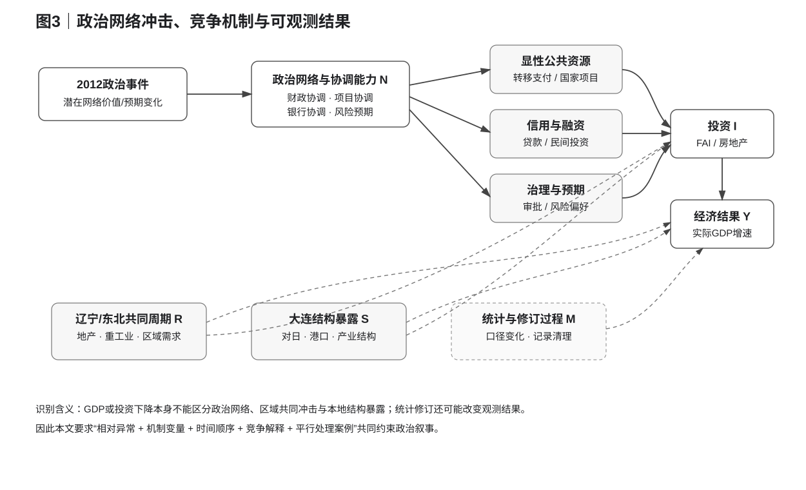

# 02｜制度背景、政治网络机制与可检验假说

## 2.1 2012年事件应被理解为“政治网络暴露的外生变化候选”，而不是一个天然的二元处理

本文把2012年3月作为事件时点，是因为中央在当年3月15日宣布薄熙来不再兼任重庆市委书记、常委、委员职务，随后其中央层级政治地位进一步发生变化。薄熙来此前长期在大连任职，1992年起任代市长，1993—1999年任市长，1999—2000年任市委书记等职，因此“大连是否因其政治网络变化而失去部分资源协调优势”具有明确的历史背景。不过，本文并不把这段履历本身当作处理强度的直接度量，更不把“曾在大连任职”机械等同于2012年前大连享有某个可量化的政治特权。

计量上更准确的表述是：2012年发生了一次可能改变大连既有政治网络价值的重大政治事件，而这一事件为识别政治网络机制提供了一个自然断点。设 \(N_t\) 表示大连在年份 \(t\) 可利用的高层政治协调能力或非正式网络资本，它既无法被直接完整观察，也不会在2012年从1瞬间跳到0。事件更可能改变 \(N_t\) 的边际价值、可调用范围或者市场主体对其未来有效性的预期，因此本文把2012年视为“潜在网络冲击发生期”，而不是把 \(D_t=1[t\ge 2012]\) 解释成一个完美测量的处理变量。

这种处理非常重要，因为本文面对的不是一个标准政策试点。一个城市的政治网络没有公开、稳定且连续的量表，事件也可能同时影响辽宁其他地区；与此同时，地方经济结果还受到全国周期、东北共同冲击、产业结构、房地产和统计口径调整的影响。因此，本文的识别策略不是假装存在一个无争议的“薄熙来处理组”，而是把政治网络理论拆成若干具有不同可观测预测的机制，再让这些预测与竞争解释接受同一组数据检验。

事件来源采用新华社2012年3月15日公开通报的转载文本；薄熙来在大连的任职履历采用同期公开简历。事件事实本身没有争议，但从事件到大连经济结果之间的因果链正是本文要研究、而不是预先假定成立的对象。

---

## 2.2 理论起点：政治网络为什么可能影响地方经济

政治网络影响地方经济并不要求存在直接、可见的“特殊拨款”。在层级治理体系中，上级与地方之间存在大量需要协调的信息、预算、项目、审批、融资和政策执行问题，非正式网络可以降低沟通和协调成本，也可能影响有限资源的边际分配。Jiang and Zhang（2020）利用中国城市领导人与省级领导之间的晋升关系构建非正式政治联系，发现与省级主要领导存在网络联系的城市领导获得更多财政转移，并且其证据更支持“网络促进政策协调”而不只是简单的寻租解释。这一结果为本文提供的是一般机制依据，而不是大连的直接效应参数；该文的估计对象、处理定义和识别设计都不能直接搬用到2012年的大连。

从地方增长的角度，政治网络至少可能通过三个中间层影响经济活动。第一层是**显性的公共资源配置**，包括税收返还和转移支付、国家级平台、重大项目、央企新增投资和基础设施审批；第二层是**半市场化的资源协调**，包括银行风险评价、授信扩张、项目融资和地方政府对金融机构或大型企业的协调能力；第三层是**地方治理和预期**，包括干部的风险承担、招商积极性、审批速度以及民营企业对未来政策稳定性的判断。这三条机制可能相互作用，但它们留下的数据痕迹并不相同，因此必须分开检验。

为便于后文识别，可以把大连的经济结果抽象为：

\[
Y_t = F(N_t,\;R_t,\;S_t,\;C_t,\;M_t,\;\varepsilon_t)
\]

其中，\(N_t\) 是本文关注的政治网络与协调能力，\(R_t\) 表示辽宁/东北共同周期，\(S_t\) 表示大连自身产业和外需结构，\(C_t\) 表示信用与金融条件，\(M_t\) 表示统计口径和测量过程。2012事件如果产生经济效应，可以直接改变 \(N_t\)，也可能通过 \(N_t\rightarrow C_t\rightarrow I_t\rightarrow Y_t\) 这样的链条发挥作用；问题在于，\(R_t\) 和 \(S_t\) 同样能够同时改变信用、投资和产出，因此仅观察到信贷或GDP下降不足以识别政治网络。

图3把本文的识别困难画得更清楚。政治事件可能通过政治网络、资源协调和预期影响投资及产出，但东北共同周期、房地产、对日暴露和地方产业结构也同时作用于信贷、投资和GDP。统计治理和历史数据修订还会影响我们观测到的GDP和固定资产投资。因此，本文后面不会把任何单一中间变量的下降自动解释为政治机制，而是要求不同链条之间出现时间顺序、相对差异和交叉验证。

---

## 2.3 假说一：显性资源配置渠道

最强版本的政治网络故事是：薄熙来失势之后，大连与更高层级的关系显著弱化，继而导致预算内支持、国家级平台、央企项目或重大投资明显减少。如果这一机制是大连2014—2015失速的主因，那么资源变量应当在GDP明显下滑之前或至少同步出现相对断点，而且这种变化应该不仅表现为“项目新闻变少”，而应体现在可比的资金流、项目批复或新增投资流上。

这一假说可以写成一个一阶段预测：若政治网络冲击首先作用于上级资源配置，则应观察到

\[
\Delta Resource_{Dalian,post}
<
\Delta Resource_{control,post},
\]

并且该相对下降不应完全由辽宁全省共同财政压力解释。理想数据是城市可比的上级转移支付、央企新增投资实际流量和国家项目年度拨款，而不是项目总投资额或新闻中披露的多年计划金额。由于这些变量的跨城可比历史面板并不完整，本文在这一渠道上的证据主要承担“约束强叙事”的角色：如果2012后预算内支持并未断崖、国家级平台仍持续获批、大型外部投资仍能落地，那么“政治资源总闸门被关闭”的强版本就受到直接反证。

这一点也解释了为什么后文不会把财政支出减本级收入当成“上级转移”。地方财政中存在债务、政府性基金、结转结余和不同口径的调入资金，用残差拼接“上级支持”会制造虚假的政治资源变化。只有预算决算文件中明确披露的中央和省级税收返还、转移支付或可以同口径比较的项目资金，才进入这一机制的核心证据。

---

## 2.4 假说二：信贷与边际融资渠道

政治网络的作用未必主要体现在财政总量上。更现实的一种机制是，正式预算支持保持稳定，但地方在边际项目、银行协调、风险容忍和融资便利度上的优势下降。由于银行贷款、地方投资项目和大型企业之间存在信息不对称，地方政府在项目筛选、担保协调、政策预期和跨部门沟通中的作用可能影响银行的风险评价；如果既有政治网络的价值下降，这种影响首先可能出现在“是否继续给边际项目加杠杆”，而不是出现在所有融资同时归零。

因此，信贷渠道的可检验预测与财政渠道不同。如果政治网络通过边际融资发挥作用，事件后应当观察到大连贷款增速相对区域基准逐步走弱、民间投资更明显降温，并且这种变化的时点应当与2014—2015的增长异常大体一致。与此同时，强企业或成熟项目仍可能通过债券、资本市场、政策性资金或其他融资工具获得资金，所以“社会融资总量没有崩塌”并不自动否定政治机制，反而可能意味着融资条件发生了主体分化。

但这一机制同样存在严重的反向因果问题。地产和工业盈利恶化会使银行主动收紧，也会使企业减少借款需求；不良贷款上升既可能是信贷紧缩的原因，也可能是前期投资质量恶化的结果。因此，本文把信贷变量首先当作**机制结果变量**而不是控制变量。后文不会在GDP回归中简单加入贷款增速，再把政治事件系数下降的部分解释为“信贷中介比例”，因为这会把受处理影响的事后变量作为控制项，产生典型的 post-treatment bias。

---

## 2.5 假说三：地方治理、干部风险偏好与项目执行

第三条机制不是“中央不给资源”，而是政治事件改变地方官员和市场主体的风险偏好。一个长期依赖强协调、重大项目和政府推动的城市，如果突然面临政治环境变化，地方干部可能减少高风险决策，企业可能推迟依赖政府协调的投资，银行也可能对与地方平台相关的项目重新定价。这个机制的特点是，它未必要求党政一把手立刻更换，也未必造成预算转移下降，而可能表现为投资兑现速度、民间投资、审批和项目执行的渐进变化。

如果这一机制很强，数据上应看到两个条件。其一，事件后的治理或投资变化应当具有大连特异性，而不是辽宁所有城市同时发生；其二，治理变化应当在结果变量之前或至少同步出现。反过来，如果2012—2013大连党政主要负责人保持稳定，国家级平台和大型项目仍然持续推进，那么“事件一发生地方治理立刻停摆”的版本就缺乏支持；这并不能排除更细微的风险偏好变化，但会迫使政治解释从“全面失灵”缩小到“边际放大”。

在这一渠道上，最难的问题是测量。审批速度、干部风险偏好和非正式协调并没有稳定的城市年度指标，容易诱发研究者用新闻数量、讲话语气或少数项目故事代替真正的机制变量。本文因此坚持较高门槛：无法形成可比数据时，新闻和项目案例只能作为机制背景，不进入主计量；如果证据不足，结论就停留在“无法排除”，而不是用定性材料替代识别。

---

## 2.6 竞争假说一：辽宁/东北共同的地产与高投资周期

政治网络不是唯一在2012以后恶化的变量。辽宁和东北在2013—2016经历了极强的固定资产投资与房地产下行，如果大连的失速主要来自区域共同周期，那么大连与辽宁应在投资、房地产和部分信用指标上表现出高度同步，而大连相对辽宁的额外恶化应显著小于大连相对武汉、青岛等省外城市的恶化。

这条竞争假说非常关键，因为它决定了省外对照的含义。一个简单的“大连减武汉/青岛”可以去除全国共同时间冲击，却不能去除辽宁特有冲击；因此省外差距既包含潜在政治因素，也包含东北区域周期。后文将通过“省外对照 + 辽宁嵌套参照”的两层比较来量化这一点，但必须强调：辽宁包含大连，而且政治网络可能同时影响辽宁其他地区，所以辽宁不是干净的未处理对照，只能用于描述共同区域成分。

如果数据显示大连和辽宁在房地产投资占固定资产投资的比例、房地产投资增速和总投资断崖上高度一致，那么这会显著削弱“2012政治事件单独造成投资崩塌”的解释。相反，如果大连在辽宁整体稳定时独自出现投资和信用断点，政治或其他大连特有机制的解释空间才会增加。

---

## 2.7 竞争假说二：对日暴露和产业结构成熟

大连第一轮增长与日本制造业、外包服务和对日投资联系很深，因此2012以后中日关系变化、日本企业海外投资周期和既有对日产业体系进入成熟阶段，都可能制造大连特有而非辽宁共同的冲击。这一机制尤其危险，因为它会被省外城市对照误认为“大连特有残差”，而其发生时点又与政治事件接近。

这一竞争机制有两个不同预测。若存在2012后的即时外资撤离冲击，则日本实际投资、项目数量和相关外贸应在2012—2014迅速断崖，并与GDP异常同步；如果更多是长期成熟，则存量企业仍可能继续增资，但新项目进入逐步减少，对日体系的新增增长贡献下降。现有研究资料显示，大连日资的“存量继续、项目新增减少”比“2012后立即全面撤资”更符合数据，因此后文会把日本因素更多作为长期结构压力，而不是自动当作2014失速的即时触发器。

这条机制也提醒我们，不能把所有“大连相对辽宁的剩余”理解成政治效应。大连的外向型结构与辽宁内陆城市不同，任何只用辽宁平均值做差的模型都可能把对日暴露、港口经济和产业结构差异留在残差中。因此，本文把结构暴露作为政治解释必须面对的竞争机制，而不是把它作为事后控制变量机械吸收。

---

## 2.8 竞争假说三：统计治理、修订和测量断点

辽宁数据在2016年前后存在已公开讨论的统计治理和历史修订问题，大连名义GDP与固定资产投资序列也出现明显的口径变化。若不区分“当年公报值”和“后续统一修订值”，研究者可能把统计清理造成的记录变化误认为真实经济断点，尤其是把2016年之后的名义水平直接与此前不同 vintage 的数值拼接时。

因此，本文在理论上把测量过程 \(M_t\) 单独放进因果图。主基准事实优先使用当年公报公布的**实际GDP增速**，因为它能较好回答“当时统计口径下城市增速如何变化”这一描述性问题；但要升级到严格的对数实际产出事件研究或合成控制，则必须使用同一统计年鉴版本中的统一修订历史序列。只要这一数据门槛没有满足，本文就不会用后期修订的名义GDP水平与早期公报值拼出一个看似精确的累计“产出损失”。

测量假说的可检验预测是：如果某个断点主要由记录方式变化造成，它应在统计序列中表现得比实体交叉指标更剧烈，而且可能集中在特定修订年份。相反，如果GDP、房地产、贷款和民间投资在相近时期共同转弱，那么纯粹的测量解释就不够。本文后续会通过多指标交叉验证来降低这一风险，而不是假定任何一套官方序列天然不存在修订问题。

---

## 2.9 可证伪假说与证据判定规则

表2把本文的核心假说、预测和反证标准放在同一张表中。这样的设计是为了防止事后叙事：不是看到哪个指标下降就把它归入政治机制，而是在看结果之前先规定，如果某个机制是主要解释，它应该同时出现哪些事实，又有哪些观察会明显削弱它。

[表2｜假说、机制与可检验预测](./tables/table02_hypotheses.csv)

本文特别区分“支持”“相容”和“识别”三个层级。某个结果与政治机制相容，只意味着它没有违反该机制的时间和方向预测；只有在竞争机制被充分约束、处理暴露和反事实都具有可信识别时，才可以进一步使用“因果效应”语言。后续章节如果只能做到相容性检验，就会明确写成机制证据，而不会把它升级成已识别的处理效应。

从这个角度看，本文最重要的研究设计不是某一个回归式，而是一套逐层缩小解释空间的规则。省外对照先确定是否存在异常，辽宁嵌套参照识别区域共同成分，地产、对日和信用变量比较竞争机制，财政与项目数据约束政治强版本，重庆平行案例检验“政治网络坍塌必然造成经济断崖”的普遍命题。只有当这些证据彼此一致时，政治网络才有资格成为主要解释。

---

## 2.10 本章小结

本章没有估计任何“薄熙来系数”，而是把一个直觉性的政治故事改写成六组可以被数据检验的命题。政治网络可能通过显性资源、边际融资和地方治理影响大连经济，但东北共同周期、地产、对日结构和统计修订都可能产生相似的表面结果，因此后续实证必须在这些机制之间做竞争，而不是把事件后的所有异常都归给政治。

这种处理也决定了本文的语言边界。即使后文确认2014—2015存在显著的大连特有失速，仍然需要进一步证明它在时间、渠道和反事实比较上更符合政治网络机制，才能把“政治事件之后发生”推进到“政治事件导致”。下一章将详细说明数据如何构建、主要估计对象如何定义，以及为什么本文在当前数据条件下优先报告透明的相对差值、趋势敏感性和机制结果，而不是用常规显著性星号包装一个单一处理城市的脆弱估计。