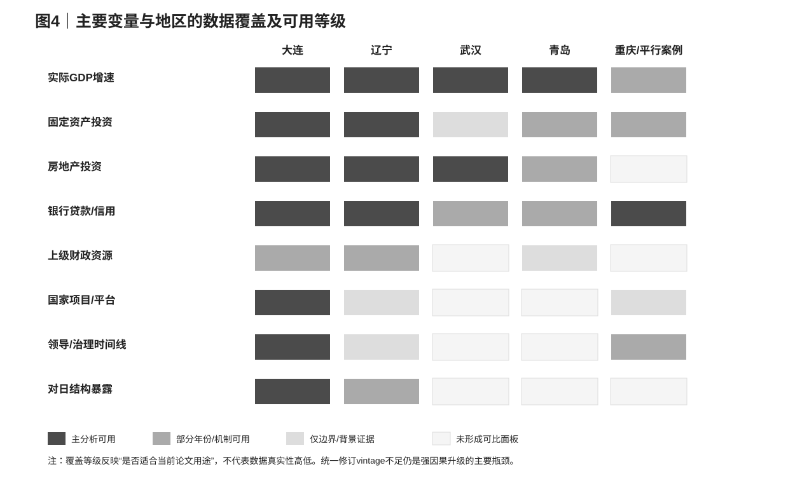

# 03｜数据、样本与识别策略

## 3.1 数据原则：先区分“历史上当时报告了什么”和“今天回看真实轨迹是什么”

本文使用的地方宏观数据存在一个容易被忽略的问题：同一个城市同一个年份的GDP水平或增速，可能因为经济普查、统一核算、统计制度调整和历史修订而存在多个版本。若把2008年的当年公报值、2014年的另一版年鉴值和2019年统一核算后的回溯值直接拼接，就会把统计版本差异混入事件研究；如果恰好修订发生在2012附近，甚至可能制造一个不存在的“政治断点”。

因此，研究数据库从一开始就把数据分成两类。第一类是 **as-reported panel**，即每个年份当时发布的统计公报、预算执行报告和金融运行报告中的数值，用于重建当时统计口径下观察到的增长、投资和信贷路径。第二类是 **revised vintage panel**，即同一版后期统计年鉴对历史年份统一回溯后的序列，理论上更适合做对数实际产出事件研究、合成控制和累计产出缺口估计。当前数据库对第一类资料已经较完整，但城市间同一 vintage 的长历史实际产出序列仍未完全获得，因此本文基准结果明确停留在“实际GDP增速的相对异常”和机制比较，而不把混合版本的名义GDP水平包装成精确因果估计。

这一数据策略看起来保守，但它直接决定研究可信度。烟台2013年就是一个典型例子：二手历史聚合序列给出约6.3%的增长，而当年官方公报记录约10.2%，两者差异远大于本文想识别的若干个百分点政治效应。如果不先做 vintage audit，任何合成控制权重和事后缺口都可能主要在拟合统计修订，而不是拟合经济活动。

---

## 3.2 观察单位、研究窗口与事件定义

主结果数据的观察单位是“城市—年份”，核心处理单位是大连。主省外比较组使用武汉和青岛：武汉提供大型区域中心城市参照，青岛提供沿海港口、开放型工业城市参照；二者的共同作用不是声称它们与大连在所有维度完全可比，而是先构造一个不受辽宁共同周期直接支配的省外增长基准。宁波、厦门、烟台及更大的城市池目前用于供体筛选和合成控制可行性诊断，只有在统一历史数据版本通过审计后才会升级为正式因果供体。

主事前窗口设为2008—2011年，2012年单列为过渡年，主事后窗口设为2013—2015年。这样处理有三个原因：第一，政治事件发生在2012年3月，年度GDP无法精确区分当年前两个月和后十个月，直接把2012全部标为“已处理”会夸大时间精度；第二，经济传导存在滞后，财政、信贷和投资渠道未必在事件当年立即反映到GDP；第三，2016年辽宁和大连的统计记录出现明显异常与口径风险，因此2013—2015更适合作为主短期窗口，2016仅作为扩展敏感性年份单独报告。

研究设计不把2012视为一个“政策执行日后所有单位立即改变”的标准DiD处理。更准确地说，2012是一个潜在政治网络价值发生重大变化的事件年份，而后续经济反应可能在2013—2015逐步显现。由于处理强度不可直接观测，本文的估计对象首先是“事件后大连相对反事实的异常变化”，随后才通过机制证据讨论其中与政治网络解释相容的部分。

---

## 3.3 数据来源层级与质量控制

所有观测都保留地区、年份、变量、单位、名义/实际属性、统计范围、来源ID、发布日期、来源类型和质量备注。主结果优先使用城市统计局、省统计局、财政部、人民银行、国务院及其他政府部门的原始公开页面；原始页面无法恢复时，才使用明确署名统计部门的公报镜像或官方转载，并在字段中标记。商业数据库或二手历史聚合序列只用于供体筛选、查找原始表和版本差异诊断，不在主基准结果中静默替代缺失的官方数值。

GDP结果变量采用官方公布的实际增速百分数，而不是用名义GDP水平自行计算增速。固定资产投资同时记录投资额、增长率和统计范围，因为2011年前后“全社会固定资产投资”“固定资产投资（不含农户）”以及项目起报点的变化会破坏跨年可比性。房地产开发投资、银行贷款、民间投资、财政转移和重大项目则各自保留原始口径，缺失值全部记为NA，不使用线性插值或新闻预测补齐关键事件窗口。

图4总结了当前可以进入正文的主要数据覆盖。它不是“数据越多越好”的展示，而是明确告诉读者哪些结果可以做相对比较、哪些只能做机制证据、哪些仍然构成识别瓶颈。

[表3｜核心变量、口径与计量用途](./tables/table03_data_dictionary.csv)

---

## 3.4 基准估计对象：相对增长异常，而不是政治ATT

设 \(g_{it}\) 为城市 \(i\) 在年份 \(t\) 的官方实际GDP增速。对大连的主省外参照定义为武汉和青岛的等权平均：

\[
\bar g_{C,t}=\frac{g_{Wuhan,t}+g_{Qingdao,t}}{2}.
\]

年度相对差值定义为：

\[
G_t=g_{Dalian,t}-\bar g_{C,t}.
\]

本文第一组基准统计量是事前与事后的差值均值变化：

\[
\Delta^{out}
=
\frac{1}{|T_1|}\sum_{t\in T_1}G_t
-
\frac{1}{|T_0|}\sum_{t\in T_0}G_t,
\]

其中 \(T_0=\{2008,2009,2010,2011\}\)，\(T_1=\{2013,2014,2015\}\)。按照本文符号，负值表示大连相对省外参照的表现恶化。这个量与两组两期DiD在算术上相似，但本文故意称其为“相对增长异常”而不是ATT，因为处理组只有一个、处理暴露无法精确测量、控制组很小，而且平行趋势假设尚未被充分建立。

为了观察动态路径，本文还构造以2011为基期的事件差值：

\[
E_t=G_t-G_{2011}.
\]

\(E_t\) 的作用是把每个年份的大连相对差距都锚定到事件前最后一年，便于识别2013、2014、2015究竟是逐步恶化还是单年异常。由于样本规模和处理结构不支持可靠的常规聚类推断，主文首先报告系数路径和数值，而不是给每一个年份附上容易误导的显著性星号。

---

## 3.5 供体敏感性：不能让一个控制城市决定故事

等权武汉—青岛不是唯一可能的反事实，因此本文预先报告 leave-one-control-out。只保留武汉时：

\[
G^{WH}_t=g_{Dalian,t}-g_{Wuhan,t},
\]

只保留青岛时：

\[
G^{QD}_t=g_{Dalian,t}-g_{Qingdao,t}.
\]

如果主结果完全由某一个控制城市的特殊波动驱动，那么两种单独比较应该给出差异很大的方向甚至相反符号；如果二者都显示大连在2013—2015明显恶化，省外相对异常的事实基础就更稳。第一章已经报告两种比较均为约−4至−5个百分点量级，因此后续机制分析不是建立在一个单一供体的偶然走势上。

此外，本文对2008—2011的 \(G_t\) 拟合简单线性事前趋势，并将其外推到2013—2015：

\[
G_t=\alpha+\beta t+u_t,\qquad t\in T_0.
\]

随后计算事后实际差值减去趋势预测的平均残差。这不是“修正后的真实政治效应”，因为四个事前年份不足以保证线性趋势就是无事件反事实；它只回答一个敏感性问题：主结果是否主要来自事件前大连相对优势本来就在下降。若趋势调整后仍存在明显负偏离，说明“原有下降趋势”不能完全吸收2014—2015的异常。

---

## 3.6 辽宁嵌套参照：把区域共同变化与大连特有变化分开

主省外对照解决不了辽宁共同冲击，因此本文定义第二个描述性差值：

\[
L_t=g_{Dalian,t}-g_{Liaoning,t}.
\]

同样计算其事前—事后均值变化 \(\Delta^{LN}\)。如果 \(|\Delta^{LN}|\) 远小于 \(|\Delta^{out}|\)，说明大连相对省外城市的恶化中有相当部分与辽宁整体相对省外的恶化重叠。为了让这个逻辑透明，本文还报告纯算术差：

\[
\Delta^{regional}
=
\Delta^{out}-\Delta^{LN}.
\]

这个量不能称为“东北因果贡献”，因为辽宁省总量包含大连，辽宁其他城市也可能受到同一政治网络变化，且大连与辽宁在产业结构上并非完全同质。它的正确解释只是：在相同窗口中，大连相对省外参照的总恶化有多大一部分没有表现为“大连相对辽宁的额外恶化”。后文所有百分比拆分都将明确标记为 descriptive overlap，而不是结构因果分解。

从严格DiD角度看，辽宁参照存在 treatment contamination 和 mechanical inclusion 两个问题。前者意味着潜在政治冲击可能扩散到辽宁其他地区，后者意味着省级结果本身包含大连，因此它不可能是与处理单位完全独立的控制组。本文保留这一比较，是因为它对识别“东北共同周期是否重要”非常有信息量，但拒绝把它包装成第二个干净的控制组。

---

## 3.7 机制变量的估计策略：把中介当结果研究，而不是事后控制

政治网络可能通过财政、信贷和治理影响产出，因此这些变量在因果图中位于处理之后。若直接把贷款增速、固定资产投资或财政转移放进GDP回归的右侧，再观察“政治事件系数下降多少”，并把下降比例称为机制贡献，会在大多数情况下引入 post-treatment conditioning。本文因此把机制变量分别作为结果变量，研究它们自身在事件前后的相对路径。

例如，对贷款增速构造：

\[
CreditGap_t
=
LoanGrowth_{Dalian,t}
-
LoanGrowth_{Liaoning,t}.
\]

如果事件前大连与辽宁接近、事件后大连持续落后，而且该变化发生在2014—2015GDP异常之前或同步，则它与“边际信用协调弱化”机制相容。但这种证据仍不识别政治因果，因为地产和企业信用风险同样会使贷款增速下降。后文会同时报告不良贷款率、房地产投资和融资替代，检查信贷变化是更像独立政治渠道，还是更像实体下行的内生反应。

房地产、财政和项目变量采用同样原则。房地产投资与辽宁高度同步时，它支持区域共同冲击；预算内转移没有下降时，它约束“财政断供”版本；大型项目继续获批时，它约束“中央关系全面中断”版本。机制章节的目标不是给每条渠道强行估计一个百分比，而是建立相互竞争的证据矩阵。

---

## 3.8 重庆不是控制组，而是“平行处理案例”

重庆在2012事件中的政治暴露比大连更直接，因为薄熙来当时就是重庆市委书记。因此，把重庆放进大连的未处理供体池在概念上是错误的；它更适合用来检验一个普遍机制命题：如果政治网络突然坍塌通常会在一至四年内造成重点经营城市的GDP、信贷和投资断崖，那么重庆是否也应该出现相似的动态形状？

本文为重庆构造与成都、武汉均值的相对增长差，沿用与大连相同的事前—事后窗口思想，并单独比较重庆的贷款和固定资产投资路径。若重庆没有出现类似断崖，只能说明“政治网络冲击必然造成城市经济断崖”这个强普遍命题不成立；它不能证明大连的政治效应为零，因为重庆的直辖市地位、产业周期和可能存在的补偿性政策都不同。

这种“平行处理案例”在识别上更接近机制反证，而不是估计大连ATT的额外控制。本文后面会避免把“大连跌了、重庆没跌”写成两城相减的三重差分，因为两地没有满足DDD所需的可比第三维和平行差距条件。Olden and Møen（2022）强调，DDD需要清楚定义差中差之间的可比结构及相应识别假设；仅仅把两个处理地区的结果相减，并不会自动获得三重差分的因果含义。

---

## 3.9 合成控制：当前阶段用于“可行性诊断”，而不是主因果估计

单一处理城市天然适合考虑合成控制，但合成控制的可信度高度依赖事前拟合、供体可比性和数据版本一致性。Abadie（2021）特别强调，合成控制的优势来自透明的反事实构造，但在事前拟合差、供体不合适或处理单位落在供体凸包之外时，方法会失去说服力。本文已经用更大的城市池对2005—2011名义GDP指数做了预拟合诊断，但这些水平数据来自二手历史聚合且包含异步修订，因此目前只用于回答“潜在供体能不能大致复制大连事前轨迹”，不解释事后gap。

严格的四个沿海供体——青岛、宁波、厦门、烟台——对大连的事前名义GDP指数拟合较差，预期RMSPE约19.65个指数点；扩大到非辽宁城市池后，拟合改善到约2.54，主要权重落在武汉和烟台。逐一剔除武汉或烟台后，事前RMSPE升至约2.88—3.89，说明供体权重仍有一定集中度和敏感性。这些结果表明“做合成控制”在技术上可能，但它还没有跨过数据版本门槛。

因此，本文不会把现有合成路径的2012后差值作为因果主结果。只有获得同一 vintage 的城市历史实际产出或可比GDP指数、通过事前拟合与供体敏感性审计后，才会进一步报告空间安慰剂、事前留出、RMSPE比率和处理后gap。换言之，方法是否高级不是判断标准；数据是否支持这个方法才是判断标准。

---

## 3.10 推断：一个处理城市时，显著性星号不是可信度来源

本文只有一个核心处理城市，而且主省外控制数量很少。常规面板回归若直接按城市聚类，渐近近似依赖“处理组数量足够大”这一条件，而这里显然不满足。Conley and Taber（2011）以及Ferman and Pinto（2019）都讨论了少数处理组情形下传统DiD推断的困难；本文因此不把常规cluster-robust标准误当作主证据，也不会为了论文外观而给描述性差值附上装饰性p值。

当前阶段的主推断逻辑是**透明敏感性而非伪精确置信区间**。具体包括：更换省外控制、调整前后窗口、检查事前趋势、排除2016异常年份、比较区域嵌套差值，以及在供体池足够且数据版本统一后做置换/安慰剂排名。置换检验也不会机械解释成随机实验p值，因为城市并非随机接受政治网络冲击；本文会同时报告可用安慰剂数量、事前拟合筛选规则和排名分辨率。

如果后续能够建立足够大的统一城市面板，本文可以再考虑少数处理组的专门推断方法或合成控制置换框架。但在现阶段，最规范的选择不是强行输出标准误，而是诚实地把估计对象限定在数据真正支持的层级。

---

## 3.11 缺失、排除与预先确定的停止规则

关键事件窗口中的缺失值不使用插值。大连2011和2012的官方原始页面部分无法恢复时，研究先通过统计部门署名镜像、后续信用报告和其他官方材料交叉核验实际GDP增速，但不会用政府工作报告中的“预计增长”替代实际结果；青岛2012只有预计值时，主面板直接留NA，并把2012作为过渡年排除出前后均值。这样的处理牺牲了表面完整性，但避免把政策目标或预测混进实际结果。

研究还设置了明确的升级门槛。只有获得大连与供体城市可比的央企新增投资流、微观银行/企业信贷、可核验的政治网络名单与项目匹配，或者同一vintage的更长城市实际产出面板，才值得继续升级因果识别。继续增加新闻案例、第五第六个普通GDP控制城市或不同截止年份的重复均值，不会解决当前最重要的识别瓶颈。

这一停止规则也是论文规范的一部分。实证研究最危险的不是数据少，而是在看过结果后不断尝试新窗口、新供体和新代理变量，直到出现最符合故事的版本。本文把现有缺失和排除项全部保存在可复现的数据审计表中，并在后文结果章节按预设主窗口和敏感性顺序报告，不根据结果重新挑选规格。

---

## 3.12 复现与数据审计

研究目录保留原始数据表、来源索引、分析脚本和派生结果。主增长面板来自 \`data/official_growth_panel_s02d.csv\`，基准差值与敏感性由 \`scripts/analyze_official_growth_panel.py\` 生成；信贷、房地产、重庆平行案例和供体可行性也分别有独立脚本。每个输出文件都尽量保留“允许用于什么、不允许用于什么”的解释字段，以防后续写作把一个描述性诊断重新命名为因果结果。

在论文最终版本中，表格和图形将直接对应这些可复现输出，而不是手工从正文抄数字。所有关键来源ID回链到 \`data/sources.csv\`，其中保存原始URL、发布机构、定位信息和提取日期。这样做的目的不是增加技术装饰，而是让任何一个关键数字都能沿着“论文图表 → 派生CSV → 原始数据 → 来源页面”逆向检查。

---

## 3.13 本章小结

本文的实证策略可以概括为“先做可信的弱识别，再逐步升级”，而不是先选一个最像因果识别的模型。当前数据最可靠地支持省外相对增长异常、辽宁嵌套比较和若干机制路径，因此这些构成主结果；合成控制、DDD和更强的事件研究只有在数据和识别假设真正满足时才升级，不因为方法名称更高级就优先使用。

这样的代价是，本文可能最终无法给出一个精确的“政治因素使大连GDP少增长X个百分点”的单一系数。但这恰恰比伪精确更符合计量经济学规范：估计对象、数据版本、处理暴露和推断方法都必须与实际证据相匹配。下一章开始进入基准结果，首先系统回答2012后大连的省外相对异常到底有多大、从哪一年开始、对供体和事前趋势有多敏感。