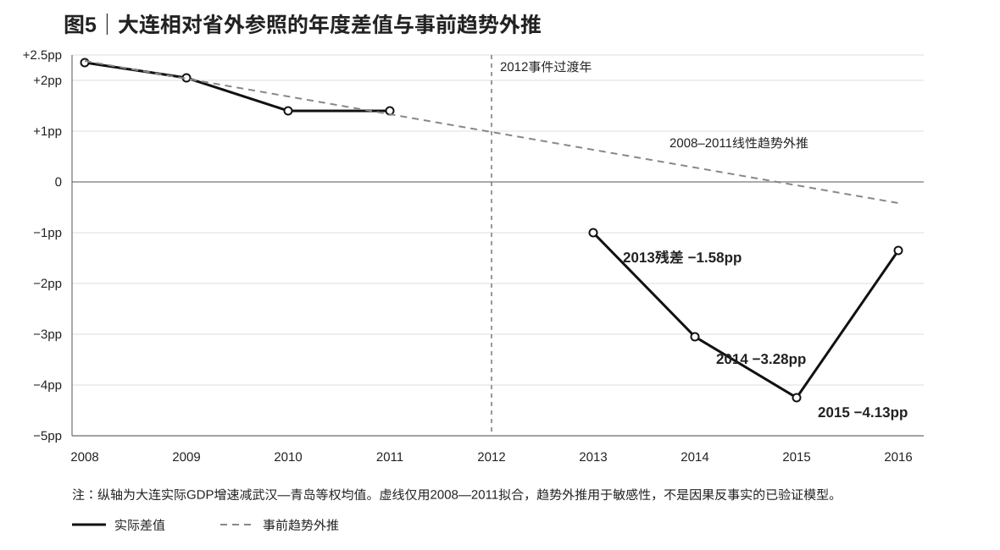

# 04｜基准结果：2012年后大连是否出现省外相对异常

## 4.1 基准规格及其与两维固定效应的关系

本章只回答一个问题：在不引入辽宁共同冲击和具体机制之前，2012年后大连相对于省外参照城市到底出现了多大的增长异常。基准样本包括大连、武汉和青岛，事前期为2008—2011年，2012年作为事件过渡年排除，主事后期为2013—2015年。结果变量是各地当年统计公报公布的实际GDP增速，控制组基准采用武汉与青岛的等权平均。

定义年度差值 \(G_t=g_{Dalian,t}-(g_{Wuhan,t}+g_{Qingdao,t})/2\)，基准估计量为事后均值减事前均值。这个统计量把全国共同年份波动从大连的绝对增速中部分净化出来，但仍保留所有辽宁特有和大连特有冲击。

\[
\hat\Delta^{out}
=
\bar G_{2013:2015}
-
\bar G_{2008:2011}.
\]

在当前三城市、等权控制和前后窗口设定下，这个估计量与下面简单两维固定效应回归中的交互项系数在数值上完全一致。把二者并列展示，是为了说明差值估计具有标准DiD的代数形式，而不是为了暗示其已经满足完整的因果识别条件。

\[
g_{it}=\alpha_i+\lambda_t+
\beta(Dalian_i\times Post_t)+\varepsilon_{it},
\]

其中2012年从样本中排除，\(Post_t=1\) 对应2013—2015年。OLS得到 \(\hat\beta=-4.5667\) 个百分点。本文仍把它称为“基准相对异常”而不是ATT，因为平行趋势、处理独立性和少数处理组推断条件没有得到充分满足；回归式在这里主要用于说明估计量的计量含义，而不是借固定效应符号制造更强的因果声称。

---

## 4.2 年度路径显示，主要分叉集中在2014—2015年

图5同时画出年度相对差值和仅用2008—2011拟合的线性事前趋势。事前四年的 \(G_t\) 分别为+2.35、+2.05、+1.40和+1.40个百分点，大连的相对优势确实已经存在缓慢收窄，因此不能把2013以后所有下降都视为突然出现的结构断点。线性拟合对应每年约−0.35个百分点的事前斜率，这一事实也是本文后续坚持做趋势敏感性的原因。

真正显著偏离事前趋势的是2014和2015。按照事前线性趋势，2013、2014、2015的差值预测约为+0.58、+0.23和−0.13个百分点，而实际值分别为−1.00、−3.05和−4.25个百分点，因此逐年趋势残差约为−1.58、−3.28和−4.13个百分点。三年平均残差为−2.99个百分点，说明即使允许大连原有相对优势按事前趋势自然衰减，2014—2015仍存在明显额外负偏离。

以2011年为事件前最后一年重新归一化也得到相同的动态形状。2013年相对2011的差值恶化约2.40个百分点，2014年扩大到4.45个百分点，2015年达到5.65个百分点；2016年则收窄到约2.75个百分点。这样的路径更像一个在事件后两至三年达到峰值、随后部分恢复的短中期异常，而不是2012年当年立即发生并永久保持同一幅度的水平跳跃。

---

## 4.3 主前后窗口：−4.57个百分点的经济含义

2008—2011年，大连实际GDP增速平均为15.05%，武汉—青岛等权均值约为13.25%，因此大连平均领先1.80个百分点。2013—2015年，大连平均增速降至6.33%，两个参照城市均值约为9.10%，大连转为平均落后2.77个百分点。前后差值变化为−4.57个百分点，这就是本章的基准估计量。

这个数字的经济量级并不小。它并不是说大连GDP水平因政治事件下降了4.57%，也不是三年累计产出损失为4.57%；它表示“年实际GDP增速相对于两个省外参照城市的平均差距”在前后窗口发生了约4.57个百分点的逆转。若要把这一增长率差进一步转换为累计实际产出缺口，需要统一的实际产出指数和明确反事实路径，而当前不同城市历史GDP水平仍存在版本不一致，因此本文有意不做这一步外推。

表4汇总基准规格和预先设定的敏感性。把事后窗口延长到2016后，等权省外比较仍为−4.21个百分点；只使用武汉时主窗口为−4.22，只使用青岛时为−4.92。不同规格都保持负号且量级接近，说明“2013—2015大连相对省外城市明显掉队”是一个相对稳定的描述性事实。

[表4｜省外基准异常与供体、窗口、趋势敏感性](./tables/table04_baseline_results.csv)

---

## 4.4 单独控制城市并不改变方向

控制城市选择是小样本城市事件研究最容易产生研究者自由度的地方。如果武汉恰好在2013—2015经历异常高增长，那么大连相对武汉恶化并不能说明大连自身出现特殊问题；同样，如果青岛在某一年有统计修订或产业周期，等权平均也可能被单个城市拖动。因此，本章把leave-one-control-out放在主结果旁边，而不是藏到附录。

相对武汉，大连在2008—2011平均领先1.05个百分点，2013—2015平均落后3.17个百分点，前后变化为−4.22个百分点。相对青岛，大连事前平均领先2.55个百分点，事后平均落后2.37个百分点，前后变化为−4.92个百分点。两组结果都与等权基准非常接近，说明主结论并非依赖“武汉或青岛哪一个被选进控制组”。

不过，这种稳定性仍不能解决控制组的结构可比性。武汉和青岛共同排除了辽宁共同周期，但它们与大连在产业结构、房地产暴露、对日联系和地方财政模式上都存在差异。因此，leave-one-out加强的是“省外相对异常确实存在”这一事实，而不是“省外控制已经构成完美反事实”这一因果假设。

---

## 4.5 事前趋势：存在收敛，但不足以解释事后幅度

2008—2011的年度差值从+2.35下降到+1.40个百分点，说明大连在事件前并非严格维持水平平行差距。若完全忽视这一点，简单前后均值可能把原本已经发生的收敛趋势也计入事件后异常。本文因此用最透明的线性外推做敏感性，而不把“事前趋势统计不显著”当作平行趋势通过，因为四个事前年份没有足够功效支持这种检验。

线性趋势外推后的2013—2015平均残差为−2.99个百分点，绝对值小于原始前后差−4.57个百分点。这一差异说明，事前收敛确实解释了部分原始变化，因此任何严肃的因果解释都不应把−4.57全部归因于2012后新出现的因素。但趋势调整后仍有接近3个百分点的平均负偏离，而且偏离主要集中在2014—2015，说明“只是延续2008—2011的线性趋势”同样不足以解释数据。

这里不把−2.99个百分点称为“去趋势后的政治效应”。线性趋势只是众多可能反事实之一，四个事前年份无法证明趋势会在没有事件时保持线性，且辽宁区域冲击仍未被控制。这个结果正确的作用是界定数量级：原始异常中有一部分可以由事前相对优势收窄解释，但仍剩下一块规模可观的事后异常需要更丰富的反事实。

---

## 4.6 一个弱安慰剂：2010年前后并未出现同等幅度反转

为了检查差值序列是否本来就经常出现四至五个百分点的短期反转，本文构造一个非常弱的假事件：把2008—2009作为“假事前”，2010—2011作为“假事后”。前两年平均差值约+2.20个百分点，后两年约+1.40个百分点，变化为−0.80个百分点。这个结果说明事件前确有相对优势收窄，但其幅度明显小于2013—2015的−4.57个百分点。

需要强调，这不是正式的placebo test。两个两年窗口过短，而且2010本身处于全球金融危机后的恢复阶段，不能满足稳定政策环境的严格要求。本文保留它只是作为一个数量级比较：如果序列在事件前就频繁产生与主结果相同规模的跳动，主异常的解释力会大幅下降；当前数据至少没有显示这种情况。

---

## 4.7 2016为什么只作为扩展窗口

把2016纳入事后窗口后，大连相对武汉—青岛均值的前后变化仍为−4.21个百分点，方向和量级没有发生根本改变。但2016年的大连与辽宁宏观统计存在明显的记录和修订风险：大连当年公报实际GDP增速为6.5%，辽宁为−2.5%，同时固定资产投资等序列出现极端变动，后续统一核算还对历史GDP水平产生较大调整。把这一年与2013—2015完全同权纳入主估计，会增加测量过程而不是经济过程驱动结果的风险。

因此，本研究预先把2013—2015作为主短期窗口，把2016作为扩展敏感性。这种做法不是因为2016使某个结论“变难看”，相反省外异常加入2016后仍然明显为负；主要理由是统计口径与数据治理风险在这一年显著上升。后文涉及辽宁嵌套比较时，这一选择尤其重要，因为大连相对辽宁的差值在2016会突然翻转，若不单独处理，很容易把统计记录变化误认为经济机制逆转。

---

## 4.8 本章能够识别什么，不能识别什么

综合年度路径、单独控制、事前趋势和扩展窗口，本章可以较有把握地确认一个描述性事实：**大连在2013—2015，特别是2014—2015，相对于武汉和青岛出现了明显的额外实际GDP增速下降。**这一事实不依赖某一个控制城市，允许事前线性收敛以后仍然存在，且加入2016后方向不变，因此它足以成为后续机制研究的“待解释异常”。

但本章还不能回答异常来自哪里。省外参照无法吸收辽宁/东北共同的地产和固定资产投资周期，大连对日本、港口、重化工业和土地财政的暴露也与武汉、青岛不同，2012政治网络变化只是多个同时发生的候选解释之一。最重要的下一步因此不是继续增加更多省外控制，而是把大连放回辽宁区域背景中，比较“大连相对省外的恶化”和“大连相对辽宁的恶化”到底相差多少。

第五章将进行这一嵌套比较。如果大连相对辽宁也出现接近−4.57个百分点的同步恶化，那么大连特有机制的解释空间会很大；如果相对辽宁的恶化明显更小，则意味着大部分省外异常首先是辽宁共同下行的表现。这个比较仍不是最终因果识别，但它会第一次对“政治因素需要解释的数量空间”形成实质约束。