# 政治网络冲击与城市经济失速：薄熙来政治失势后的大连证据

**工作论文｜2026-10-07**

## 摘要

本文研究2012年薄熙来政治失势之后，大连在2014—2015出现的相对经济失速，并考察政治网络、区域投资周期与信用条件在其中的作用。文章以武汉和青岛构造省外增长参照，再以辽宁进行区域嵌套分解，并结合房地产、固定资产投资、银行信贷、财政资源、国家级平台、对日投资以及重庆平行处理案例。2008—2011至2013—2015之间，大连相对武汉—青岛的实际GDP增速差反转约4.57个百分点，而大连相对辽宁仅恶化约1.45个百分点；地产和总投资数据显示，大连与辽宁在2014—2015经历了高度同步的区域下行。在此基础上，大连银行贷款、民间投资和资产质量出现更明显的城市特有弱化，而预算内上级资源、国家级平台和大型项目保持连续。重庆在同一政治事件后也未复制大连式的投资与信用断崖。综合证据表明，辽宁地产和高投资模式转折构成主要下行背景，政治网络变化更可能通过边际融资、项目协调和风险预期影响调整幅度，其宏观后果具有明显的地方结构依赖性。

**关键词：** 政治网络；地方经济增长；大连；薄熙来；信贷；房地产；区域经济

**JEL 分类：** P16；R11；H77；G21

---

# 01｜引言

## 1.1 研究问题

2012年薄熙来政治失势之后，大连在随后数年出现了明显的经济减速。由于薄熙来曾长期主政大连，一个广为流传的解释是：原有政治网络在2012年后失去价值，大连因而削弱了向上协调项目、财政、信贷和政策资源的能力，最终在2014—2015表现为增长失速。这个解释在时间上具有吸引力，也与中国地方政治经济学关于干部激励和政治联系的研究相呼应。既有文献表明，地方干部的晋升激励与经济绩效相关（Li and Zhou, 2005），政治联系与绩效共同影响政治晋升（Jia, Kudamatsu and Seim, 2015），干部的地方关系网络会改变政策选择（Persson and Zhuravskaya, 2016），而省级政治网络还会影响城市获得的财政转移与政策协调（Jiang and Zhang, 2020）。

大连却提供了一个更困难的识别场景。2012年前后，辽宁和东北同时进入投资、房地产和传统工业增速下行阶段，大连对日本制造业、贸易与外包体系的新增红利也在减弱。政治网络变化、区域周期和城市自身结构几乎在同一时期叠加，因此仅凭“2012发生政治事件、2014经济掉速”的时间顺序无法区分这些机制。本文由此把研究问题分成三个层次：大连是否相对于省外参照城市出现异常减速；这部分异常有多少发生在辽宁整体相对省外城市的同步下行中；在区域共同变化之外，大连的信用、投资和资源配置是否出现了更具城市特异性的变化。

## 1.2 经验策略

本文首先使用大连、武汉和青岛的官方实际GDP增速构造省外相对差值。武汉提供大型区域中心城市参照，青岛提供沿海港口和开放型工业城市参照，两者共同形成一个不直接受辽宁区域周期支配的省外基准。随后，本文把辽宁作为区域嵌套参照，将大连相对省外城市的变化分解为“辽宁整体相对省外的变化”和“大连相对辽宁的额外变化”。这一设计的目的不是把辽宁当作一个完全独立的未处理组，而是定位异常主要发生在区域层还是城市层。

在机制层面，本文依次比较房地产与固定资产投资、银行信贷与民间投资、预算内上级资源、国家级平台和重大项目，并补充大连对日投资与项目进入的数据。最后，本文使用重庆作为平行处理案例。重庆在2012政治事件中的直接暴露更强，却拥有不同的行政层级和增长结构，因此它最适合检验一个更一般的命题：政治网络冲击是否会在不同地方经济结构中自动产生相似的增长、投资和信用断崖。

## 1.3 主要发现

第一，大连在2014—2015确实出现了明显的省外相对失速。2008—2011年，大连实际GDP增速平均比武汉—青岛等权均值高1.80个百分点；2013—2015年则平均低2.77个百分点，前后变化约为−4.57个百分点。只使用武汉或青岛、允许事前相对优势按线性趋势继续收窄，结果的方向和主要数量级都保持稳定，最明显的分叉集中在2014和2015年。

第二，这一省外异常的大部分发生在辽宁区域层。相同窗口中，大连相对辽宁的增长优势仅从1.95个百分点缩小到0.50个百分点，变化约−1.45个百分点；省外总异常与区域内部异常之间的差额约为−3.12个百分点。房地产和固定资产投资提供了相同方向的实体证据：2014—2015大连与辽宁房地产投资同步大幅转负，地产投资占总固定资产投资的比重也几乎重合，到2015两地总固定资产投资均较2013下降约三成。

第三，区域共同下行之外，大连出现了一条更明显的金融弱化路径。2011—2012大连与辽宁的贷款增速已基本收敛，2013以后大连开始持续落后，2014—2015差距扩大到约3.3—3.4个百分点；同期不良贷款率上升，2014年民间投资仅增长2.4%。与此同时，债券和资本市场融资仍保持扩张，显示融资环境的变化更接近银行信用与边际投资的分层，而不是所有融资渠道同时收缩。

第四，显性的公共资源没有沿着同一方向变化。2014—2015中央和省级税收返还及转移支付从188.97亿元增加到198.10亿元，2012以后金普新区、跨境电商综试区和辽宁自贸区大连片区继续获批，大型产业项目也仍能落地。2012—2013大连党政一把手保持连续。由此看，大连并未退出国家政策和大型项目体系，经济弱化更集中在地方信用、民间投资和边际项目环境。

第五，重庆没有复制大连的路径。2008—2011重庆相对成都—武汉均值平均领先1.55个百分点，2013—2016这一优势扩大到2.35个百分点；贷款和固定资产投资虽然减速，但到2016仍保持两位数增长。这个对照说明，政治网络冲击的经济后果高度依赖地方增长结构。辽宁地产和高投资模式的转折构成大连的主要下行背景，政治网络变化更可能通过边际融资、项目协调和风险预期影响调整幅度。

## 1.4 本文贡献

本文的第一项贡献是把一个人物化的政治叙事拆成多层反事实。省外参照识别大连是否存在相对异常，辽宁嵌套参照定位异常主要发生在区域层还是城市层，机制数据进一步解释城市层偏离如何形成。相较于直接把2012后的全部减速归入政治事件，这种分层设计更接近实际的地方经济传导过程。

第二项贡献是区分“显性公共资源”和“边际协调资源”。财政转移、国家级平台和大型项目在2012后仍然存在，而银行信用与民间投资的相对弱化更加明显。这一差异提示，政治联系的经济价值未必主要表现为某个可见总量，而可能体现在风险评价、项目融资、续贷和跨部门协调等边际环节。

第三项贡献是强调政治冲击的状态依赖性。大连与重庆面对同一2012政治事件却走出不同的经济路径，说明政治关系的变化需要与地方产业周期、投资机会和金融资产质量结合，才能转化为宏观结果。本文由此把政治网络从一个独立解释变量重新放回地方经济结构之中。

下文第二节介绍制度背景和可检验机制，第三节说明数据与经验策略，第四节报告基准结果和区域分解，第五节分析实体与金融机制，第六节讨论重庆平行案例，第七节给出稳健性和综合讨论，第八节总结。

---

# 02｜制度背景与研究假说

## 2.1 2012政治事件与大连的历史联系

2012年3月15日，中央宣布薄熙来不再兼任重庆市委书记等职务，随后其中央政治地位进一步发生变化（新华社，2012）。薄熙来与大连的联系并非一般意义上的短期任职：他在1980年代后期进入大连市领导班子，1992年任代市长，1993年起任市长，1999年转任大连市委书记，此后又任辽宁省领导（人民网资料，2007）。大连在这一时期推进城市建设、开发区、招商和大型项目，薄熙来本人也公开使用过“经营城市”等治理表述（《人民日报》，2001）。因而，2012事件可能使一部分建立在历史任职和政治关系上的非正式协调资本发生重新定价。

本文把这一事件理解为政治网络价值的突然变化，而不是一个可以直接观察到的二元政策处理。地方政治网络由干部关系、部门协调、信息渠道和市场预期共同构成，其影响可以持续、替代或向更大区域扩散。因此，经验分析的关键不在于给2012贴上一个简单的0/1标签，而在于观察不同资源渠道是否在事件之后出现与机制预测一致的相对变化。

## 2.2 政治网络可能通过哪些渠道影响地方经济

中国地方政治经济学文献提供了三个与本文直接相关的机制。第一是资源配置。Jiang and Zhang（2020）发现，与省级主要领导存在政治网络联系的城市领导能够获得更多财政转移，并提供了网络促进政策协调的证据。这意味着政治联系可能降低向上沟通和争取资源的成本，使某些项目、试点或财政资源更容易流向特定地区。

第二是金融和项目协调。地方政府并不直接决定商业银行的全部信贷，但它们参与项目筛选、土地与抵押安排、国企和平台协调、政策性资金对接以及企业续贷沟通。在项目回报和风险发生变化时，这些协调能力会影响边际项目是否继续获得融资。政治网络的价值下降因而可能首先反映在银行风险评价和边际授信，而不是总融资量瞬间消失。

第三是地方治理与预期。干部晋升、任职背景和政治关系会影响政策选择与风险承担（Li and Zhou, 2005; Jia, Kudamatsu and Seim, 2015; Persson and Zhuravskaya, 2016）。当外部政治环境突然变化时，即使地方党政一把手没有同步更换，官员对大型投资、招商、土地开发和政企协调的风险偏好也可能调整，企业则会重新评估未来政策稳定性和投资回报。

## 2.3 三个政治机制假说

本文据此提出三组政治机制假说。**H1：显性资源配置渠道。**如果高层政治联系是大连增长的重要支撑，事件后上级财政资源、国家级平台、重大项目或央企新增投资应当相对弱化，而且时间上应先于或至少同步于经济结果的恶化。这里关注的是资源流和项目进入，而不是项目总投资额等存量规模。

**H2：信贷与边际融资渠道。**如果政治网络的主要作用是降低项目融资和风险协调成本，则大连的银行贷款、民间投资和边际项目融资应在事件后相对辽宁或省外参照走弱。大型、成熟企业仍可能通过债券和资本市场融资，因此这一机制更容易表现为融资主体分化，而非所有渠道同步收缩。

**H3：地方治理与预期渠道。**如果事件主要通过干部行为和市场预期传导，则投资兑现、民间资本和项目推进会在事件后出现滞后变化。由于治理效果很难用单一指标度量，本文将领导连续性、市场主体进入和重大项目推进作为辅助证据，并重点观察这些变化是否与2014—2015的经济分叉在时间上吻合。

## 2.4 竞争解释

政治机制面对的第一组竞争解释是辽宁和东北共同的地产与高投资周期。大连属于辽宁，在产业、房地产和投资模式上与省内经济具有高度联动；如果2014—2015的主要冲击来自区域地产、重工业和投资下行，那么大连与辽宁应当在房地产和固定资产投资上同步转弱，而大连相对辽宁的额外恶化明显小于相对省外城市的恶化。

第二组竞争解释来自大连自身的对日结构。大连长期深度参与日本制造业、贸易和软件外包体系，因而日本企业新增进入放缓、日元环境变化和产业成熟会比辽宁内陆城市更直接地影响大连。这个机制既可能构成长期增长发动机减弱，也可能在特定年份与外需和制造业周期叠加。

第三组竞争解释是信用风险与实体经济反馈。房地产销售、工业利润和项目回报下降会提高不良贷款率，银行由此收紧风险偏好，企业也会减少借款需求；信用收缩又会反过来削弱投资。政治协调与这种内生金融反馈可能同时存在，因此本文将资产质量和融资结构与贷款增长放在同一条时间线上比较。

表1汇总各机制的主要预测。全文后续的实证顺序与这张表一致：先确定增长异常出现在哪一层，再观察哪些机制在相同时间和相同空间层级上具有最强解释力。

[表1｜研究假说与可观测预测](./tables/table02_hypotheses.csv)

资料来源：作者整理；政治网络机制参考 Jiang and Zhang（2020）、Li and Zhou（2005）、Jia, Kudamatsu and Seim（2015）以及 Persson and Zhuravskaya（2016）。

---

# 03｜数据与经验策略

## 3.1 数据与统计版本

本文使用城市和省级年度宏观数据，核心来源包括大连、武汉和青岛及辽宁省统计公报，财政部转载的预算执行报告，中国人民银行地方金融运行资料，国务院和国家发改委的政策批复，以及JETRO关于日本对大连投资的年度报告。所有观测均保留年份、单位、统计口径、来源ID和来源类型，具体原始链接和提取说明见数据附录。

地方宏观数据的一个核心问题是历史修订。经济普查、统一核算和统计制度调整会改变同一城市同一年份的历史GDP水平，因此本文区分“当年公报版本”和“统一回溯版本”。基准结果采用各年公报直接公布的实际GDP增速，用于回答当时统计口径下城市增长如何变化；名义GDP历史水平只用于供体可行性诊断。正式的长期实际产出合成控制留待各城市同一统计版本的历史实际GDP指数全部完成后再估计。

## 3.2 样本、事件窗口与结果变量

主样本包含大连、武汉和青岛。事前窗口设为2008—2011年，2012年作为事件过渡年单列，主事后窗口为2013—2015年。2012年3月发生政治事件，年度数据无法精确区分事件前后的月份；同时，财政、信贷和投资渠道具有传导时滞，因此主比较从2013年开始。2016年辽宁和大连的GDP与固定资产投资记录出现明显异常，本文将其放入扩展窗口而非主窗口。

核心结果变量 \(g_{it}\) 是地区 \(i\) 在年份 \(t\) 的官方实际GDP增速。武汉和青岛构成省外等权参照：

\[
C_t=\frac{g_{Wuhan,t}+g_{Qingdao,t}}{2},
\]

大连相对省外参照的年度差值定义为：

\[
G_t^{out}=g_{Dalian,t}-C_t.
\]

基准相对异常为事后平均差值与事前平均差值之差：

\[
\Delta^{out}
=
\overline{G^{out}}_{2013:2015}
-
\overline{G^{out}}_{2008:2011}.
\]

在当前平衡样本与等权控制下，这个统计量与包含城市固定效应、年份固定效应以及 \(Dalian_i\times Post_t\) 的简单两维固定效应回归中的交互项系数数值一致。本文同时报告年度差值路径、只保留武汉或青岛的供体剔除结果，以及基于2008—2011线性事前趋势的外推残差。

## 3.3 区域嵌套分解

省外比较无法吸收辽宁共同冲击，因此本文进一步定义大连相对辽宁的年度差值：

\[
G_t^{LN}=g_{Dalian,t}-g_{Liaoning,t},
\]

并计算同一前后窗口下的变化 \(\Delta^{LN}\)。由于

\[
G_t^{out}-G_t^{LN}=g_{Liaoning,t}-C_t,
\]

省外总异常可以分成两个层次：

\[
\Delta^{out}
=
\Delta^{LN}
+
\Delta^{regional}.
\]

这里的 \(\Delta^{regional}\) 表示辽宁整体相对省外参照的变化，\(\Delta^{LN}\) 表示大连相对辽宁的额外变化。辽宁省总量包含大连，且省域内可能存在共同政治和产业冲击，因此这一分解用于定位异常主要发生在哪个空间层级，而不是构造第二个独立处理—控制实验。

## 3.4 机制变量

机制分析把房地产投资、固定资产投资、银行贷款、民间投资、不良贷款率、预算内上级资源和重大项目分别作为结果变量。房地产与总投资用于解释区域共同下行；信贷与民间投资用于观察大连是否存在相对辽宁更强的金融弱化；财政、国家平台与重大项目用于观察显性公共资源是否与银行信用沿同一方向变化。对日结构则使用日本新项目数、实际投资及其占比，区分“新增进入放缓”和“存量企业继续投资”两种不同过程。

这些变量在经济链条中相互作用，因此本文不把它们同时塞入一条GDP回归以分解“贡献率”。机制识别主要依赖时间顺序、跨地区相对变化和不同资源渠道之间的对照。例如，若房地产与辽宁同步而贷款增长明显弱于辽宁，说明金融条件具有比地产更强的大连特异性；若财政转移和国家平台保持稳定，则银行信用的变化更可能发生在显性公共资源之外的边际环节。

## 3.5 重庆平行处理案例

重庆在2012事件中的直接政治暴露更强，但其行政层级和增长结构与大连不同。本文因此不把重庆放进大连的普通供体池，而是单独构造重庆相对成都—武汉均值的增长差，并比较重庆与大连的贷款和固定资产投资路径。这个设计检验的是政治网络冲击是否会在不同地方经济结构中产生相似的宏观动态。

## 3.6 推断与合成控制

大连是唯一核心处理城市，主省外参照数量也较少，传统按城市聚类的渐近推断在这里信息有限（Conley and Taber, 2011; Ferman and Pinto, 2019）。本文因此把年度路径、供体剔除、事前趋势、窗口敏感性和区域嵌套比较作为主推断依据，并在统一历史数据尚未完成前，把合成控制限定为事前拟合诊断。

合成控制诊断遵循 Abadie, Diamond and Hainmueller（2010）和 Abadie（2021）的基本思路：对2005—2011名义GDP指数寻找非负且权重和为1的供体组合，检查事前RMSPE和供体集中度。由于现有历史名义GDP存在异步修订，事后合成缺口不进入主结果。完整数据、脚本和派生输出均保存在 research/bo2012/ 目录中，图表与原始来源的对应关系见数据附录。

---

# 04｜基准结果与区域分解

## 4.1 大连在2014—2015出现明显的省外相对失速

图1报告2008—2016年大连、武汉和青岛的官方实际GDP增速。2008—2011年，大连始终不弱于两个参照城市；2013以后相对位置开始改变，2014和2015的分叉最明显。大连实际GDP增速从2013年的9.0%降至2014年的5.8%和2015年的4.2%，而同期武汉分别为10.0%、9.7%和8.8%，青岛分别为10.0%、8.0%和8.1%。

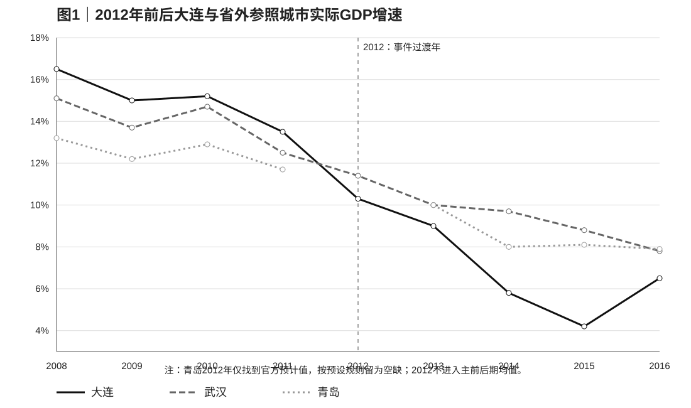

资料来源：大连市、武汉市、青岛市历年统计公报；对应来源ID见数据附录表A1。

图2直接展示 \(G_t^{out}\)。2008—2011年，大连相对武汉—青岛均值的增速差分别为+2.35、+2.05、+1.40和+1.40个百分点，平均为+1.80个百分点；2013—2015年差值转为−1.00、−3.05和−4.25个百分点，平均为−2.77个百分点。由此得到基准前后变化：

\[
\Delta^{out}=-2.77-1.80=-4.57\text{个百分点}.
\]

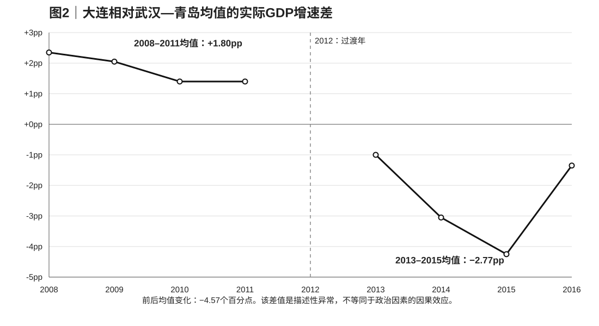

资料来源：同图1；作者计算。

在三城市平衡样本中，城市固定效应、年份固定效应与 \(Dalian_i\times Post_t\) 交互项的两维固定效应回归给出同样的−4.57个百分点。这个数值描述的是年实际GDP增速相对差距的反转，而不是GDP水平的累计损失。

## 4.2 供体和事前趋势敏感性

省外异常不依赖单一控制城市。只使用武汉时，前后变化为−4.22个百分点；只使用青岛时为−4.92个百分点。2008—2011大连相对武汉—青岛的优势本来就在缓慢收窄，因此图3用这四个事前年份拟合一条线性趋势。按该趋势外推，2013、2014和2015的差值应分别约为+0.58、+0.23和−0.13个百分点，实际值则为−1.00、−3.05和−4.25个百分点，三年平均残差约−2.99个百分点。

资料来源：同图1；作者计算。

表2汇总这些规格。不同控制和趋势处理都把主要异常定位在2014—2015。把2016加入事后窗口后，省外前后变化仍为−4.21个百分点，说明省外结果并不依赖2015作为终点。

[表2｜省外基准异常与规格敏感性](./tables/table04_baseline_results.csv)

资料来源：official_growth_panel_s02d.csv；作者计算。

## 4.3 区域嵌套分解

省外比较之后，关键问题是这4.57个百分点究竟发生在辽宁区域层还是大连城市层。2008—2011年，大连实际GDP增速平均比辽宁高1.95个百分点；2013—2015年仍高0.50个百分点，因此大连相对辽宁的额外恶化为：

\[
\Delta^{LN}=0.50-1.95=-1.45\text{个百分点}.
\]

省外总异常与区域内部异常之间的差额为：

\[
\Delta^{regional}=-4.57-(-1.45)=-3.12\text{个百分点}.
\]

图4把两条年度差值放在同一坐标系中。2014年大连和辽宁实际GDP增速同为5.8%，而武汉—青岛均值约为8.85%；2015年大连增长4.2%、辽宁3.0%，大连仍快于辽宁1.2个百分点，却明显慢于省外参照。省外分叉由此更多体现为辽宁整体掉队，而不是大连在辽宁内部突然变成最弱城市。

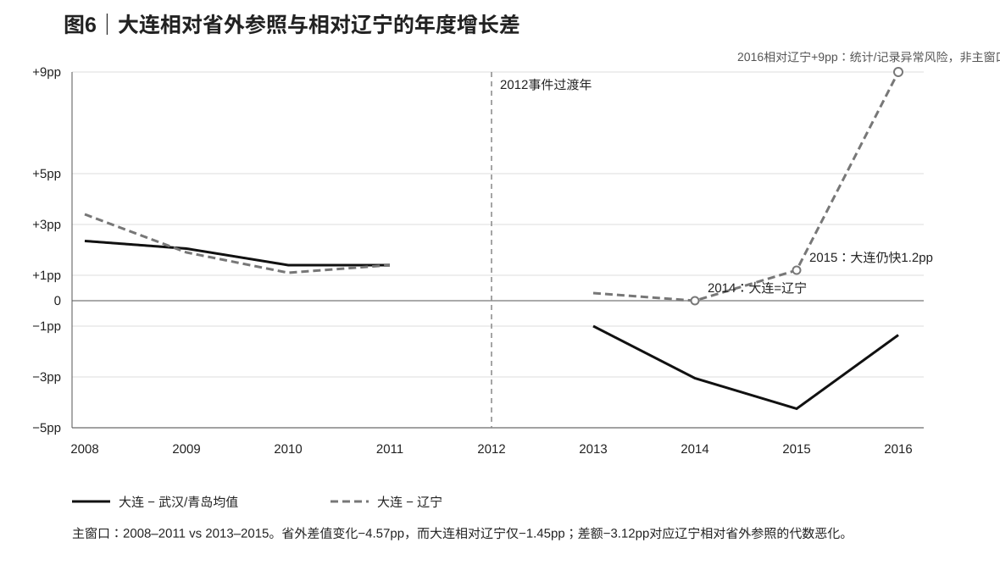

资料来源：大连市、辽宁省、武汉市、青岛市历年统计公报；作者计算。

[表3｜省外异常的区域嵌套分解](./tables/table05_regional_decomposition.csv)

资料来源：同图4；作者计算。

2016年出现了明显不同的形状：大连公报实际GDP增速为6.5%，辽宁为−2.5%，年度差值扩大到9个百分点；同期固定资产投资和历史GDP记录也发生较大变化。本文因此把2013—2015作为区域分解的主窗口，2016留作扩展敏感性。不同事前窗口下，大连相对辽宁的额外恶化大致落在−1至−2个百分点之间，数量级明显小于省外总异常。

## 4.4 从总异常进入机制分析

基准结果形成了一个清楚的层级：2014—2015大连相对省外城市存在约4至5个百分点的增长差距反转，其中更大的部分发生在辽宁整体相对省外城市的同步下行；大连相对辽宁仍存在约1至2个百分点的额外弱化。下一节据此把机制分析分成两组：房地产和固定资产投资解释区域层变化，信用、民间投资和资源配置解释大连城市层的额外偏离。

---

# 05｜机制证据：区域投资、信用分层与资源配置

## 5.1 房地产和高投资模式：区域层异常的实体基础

第四节显示，省外总异常中更大的部分发生在辽宁整体相对省外城市的同步下行。房地产和固定资产投资为这一结果提供了最直接的实体解释。2013年，大连、辽宁和武汉房地产开发投资仍分别增长22.5%、18.2%和21.0%；到2014年，大连下降16.4%、辽宁下降17.8%，而武汉仍增长23.5%、青岛增长6.6%。2015年大连和辽宁房地产投资进一步下降37.2%和约32.9%，武汉仍保持9.7%的正增长。

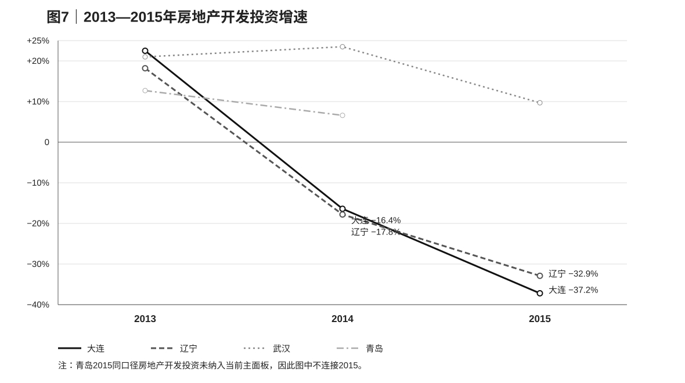

资料来源：大连市、辽宁省、武汉市、青岛市统计公报与政府工作报告；原始来源ID见数据附录表A1。

大连与辽宁不仅方向同步，投资结构也非常接近。2013年房地产开发投资占固定资产投资的比重分别为26.4%和26.0%，2014年为21.1%和21.7%，2015年为19.7%和20.2%。把2013年的投资规模归一化为100后，到2015年大连与辽宁的总固定资产投资指数分别约为70.4和71.2，房地产投资指数分别约为52.5和55.2。

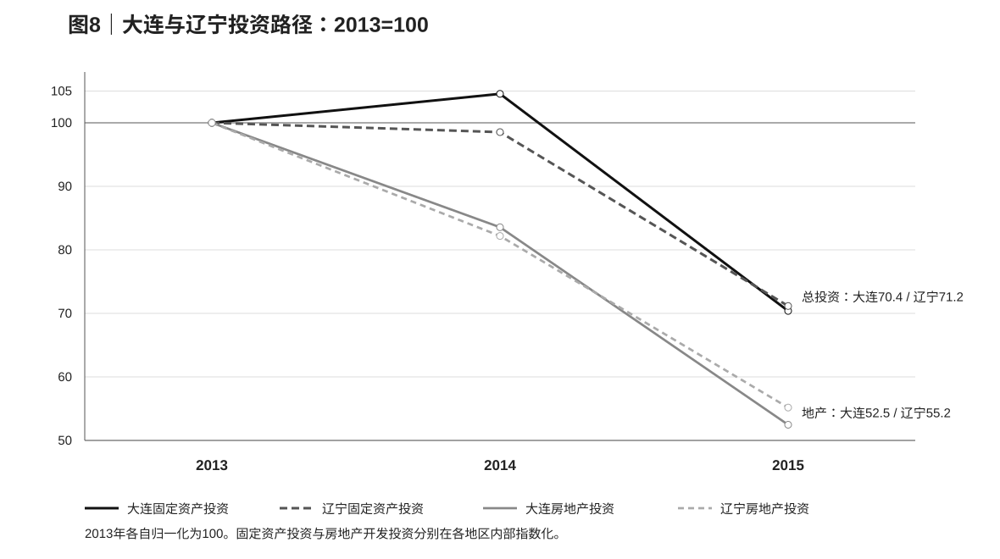

资料来源：同图5；作者计算。

2013—2015年，大连固定资产投资减少1918.8亿元，其中房地产开发投资减少812.9亿元；辽宁对应减少7151.0亿元和2892.1亿元。房地产投资减少额分别相当于总固定资产投资减少额的42.4%和40.4%。如果只看2014—2015最剧烈的一年，房地产对应比例降到24.0%和25.7%，说明2015的投资收缩已经扩展到更广泛的建设和工业项目。

[表4｜大连与辽宁固定资产投资下降的构成](./tables/table06_investment_accounting.csv)

资料来源：real_estate_land_s03a.csv；作者计算。

这组结果把第四节的区域分解落到了实体经济上。2014房地产先行转负，2015总投资进一步下坠，大连与辽宁几乎沿着同一条轨迹变化。辽宁高投资和地产周期的转折由此构成大连短期失速的主要区域背景。

## 5.2 银行信用与民间投资：大连城市层的额外弱化

与房地产不同，银行贷款在2013以后表现出更明显的大连特异性。2010年大连贷款增速曾明显高于辽宁，2011—2012两者已基本收敛；2013年大连贷款增长11.6%、辽宁12.8%，差距约−1.2个百分点；2014和2015差距扩大到约−3.4和−3.3个百分点，2016进一步扩大到约−4.3个百分点。

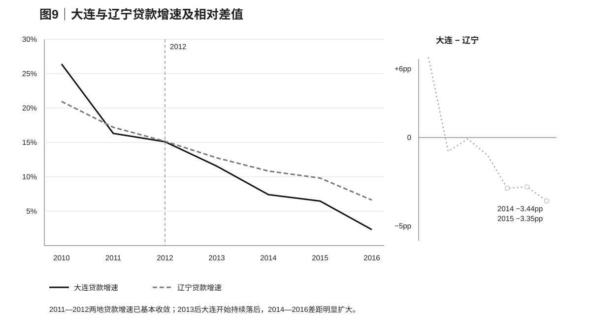

资料来源：大连市、辽宁省统计公报及人民银行金融资料；作者根据年末余额和可比新增额计算部分增速。

新增贷款份额也显示同一方向。大连新增贷款占辽宁全省新增贷款的比重从2013年的31.4%降至2014年的23.4%和2015年的21.9%。与此同时，大连不良贷款率从2013年的1.07%升至2014年的1.86%、2015年的2.16%和2016年的3.22%。

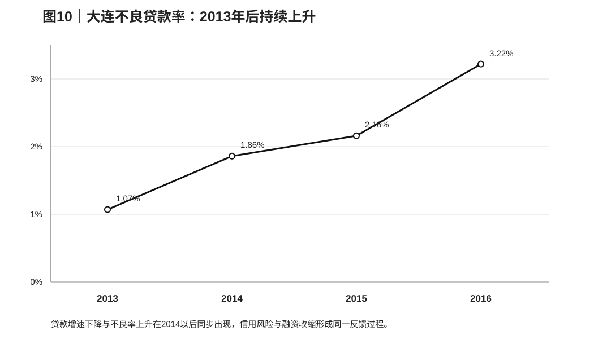

资料来源：大连市金融运行与统计资料。

2014年民间投资进一步提供了企业侧证据：大连仅增长2.4%，武汉增长16.1%，青岛增长24.0%。GDP、房地产、银行信用、资产质量和民间投资在同一年共同转弱，说明大连经历的不是单一统计指标波动，而是实体活动与金融条件相互强化的调整过程。

[表5｜2013—2016年大连信用、民间投资与融资结构](./tables/table07_credit_financing.csv)

资料来源：credit_s03c.csv、private_investment_s03c.csv、financing_structure_s03d.csv。

融资结构同时揭示了一个重要差异。2014—2016银行贷款净增从755.5亿元降至709.9亿元和267.5亿元，而资本市场直接融资仍保持在约1031亿元、1172亿元和1417亿元的较高规模。能够使用债券和资本市场的成熟企业仍有融资渠道，压力更多集中在依赖银行信用、现金流和地方协调的边际项目与民间投资。这一结构使政治网络最可能作用的环节从“城市是否有资金”转向“哪些主体在风险上升时还能获得边际信用”。

## 5.3 显性公共资源：财政、国家平台与大型项目仍在延续

银行信用走弱并没有伴随预算内上级资源同步下降。2014年中央和辽宁省对大连的税收返还及转移支付合计188.97亿元，2015年为198.10亿元，名义增长约4.8%。2011—2012财政报告使用较早分类方式，图9将其单独标识，不与2014以后强行连成同口径时间序列。

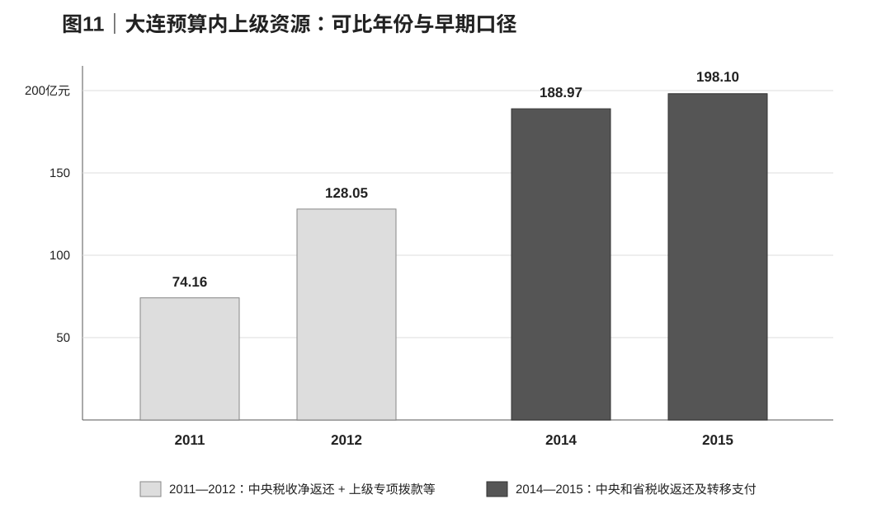

资料来源：财政部转载的大连市预算执行报告，DLF2011—DLF2015。

国家级平台和大型项目也继续推进。2014年国务院批复设立金普新区，2016年大连进入跨境电子商务综合试验区，2017年辽宁自贸试验区设置大连片区；2015年Intel宣布对大连工厂进行新一轮大规模再投资。领导时间线同样显示，市委书记唐军从2011年任职至2017年，市长李万才在2012事件后继续任职到2014年底，2014—2015的经济分叉发生在高度连续的最高层领导任期内。

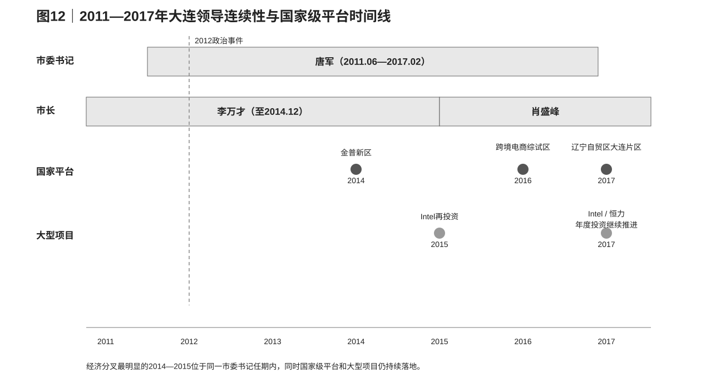

资料来源：人民网干部简历、国务院和国家发改委批复、地方政府工作报告及项目公开资料。

[表7｜财政、国家平台、领导与重大项目时间线](./tables/table08_fiscal_projects_governance.csv)

资料来源：fiscal_resource_audit.csv、leadership_timeline.csv、major_project_policy_ledger.csv。

显性资源和银行信用由此走出了不同路径。大连仍然能够进入国家政策平台、承接大型项目并获得预算内上级资源，而地方自有财力、银行信用和民间投资明显承压。政治网络若影响了2014—2015的调整，更可能发生在项目融资、续贷、风险评价和跨部门协调等边际环节。

## 5.4 对日结构：新增进入放缓，而非2014年突然撤离

大连对日本资本和企业的暴露远高于一般城市。2014年，日本实际投资约25.35亿美元，占大连实际外资18.1%；JETRO资料显示，辽宁省日资投资中八成以上集中在大连。真正持续变化的是新项目进入：日本新项目数从2012年的136个降至2013年的75个、2014年的61个和2015年的47个，三年减少约65%。

[表6｜日本对大连投资与新项目进入](./tables/table06_japan_exposure.csv)

资料来源：JETRO 2013—2015年度对华直接投资报告；2015存在统计方法调整，表中保留报告口径同比。

实际投资的时间顺序与项目数不同。2013年日本对大连实际投资约26.27亿美元，JETRO描述为约为上年的2.5倍；2014年仅下降3.5%，而同期全国日本对华FDI按中方统计下降38.8%。也就是说，大连GDP在2014已经明显相对失速，但日本资本对大连并没有同步出现突然撤离。到2015年，JETRO报告日资实际投资明显下降，不过当年统计方法发生变化，跨年绝对金额的可比性下降。

这组证据更符合“新增进入逐渐减少、存量企业继续增资和升级”的成熟过程。它能够解释为什么大连第一轮对日增长发动机的增量效应逐渐变弱，却不太适合解释2014年GDP和信贷为何突然同时分叉。对日结构因此是大连相对辽宁的长期特有暴露，而短期2014—2015的近端变化更集中在地产周期、信用风险和边际融资。

## 5.5 机制小结

四组机制拼在一起后，空间层级与时间顺序变得清楚。辽宁地产和总投资在2014—2015同步下行，对应第四节更大的区域层异常；大连银行贷款、民间投资和不良率表现出更强的城市特异性，对应区域共同下行之上的额外弱化；预算转移、国家平台和大型项目保持连续，说明显性公共资源没有与银行信用同步收缩；对日项目新增持续减少，则构成更慢的长期结构约束。

由此形成的传导链是：区域投资周期首先压低项目回报和资产质量，大连特有的金融与产业结构决定额外暴露，边际融资和协调能力影响收缩幅度。下一节用重庆检验这一机制是否具有地方结构依赖性。

---

# 06｜重庆平行处理案例

## 6.1 设计

2012政治事件与重庆的关系比与大连更直接，薄熙来在事件发生时正担任重庆市委书记。重庆同时拥有不同于大连的行政层级、产业结构和投资周期，因此本文把它作为平行处理案例，用来观察同一政治事件落在另一种地方经济结构上会产生什么动态。重庆的省外参照采用成都与武汉的等权均值，比较窗口与大连保持相近。

## 6.2 GDP相对路径

2008—2011年，重庆相对成都—武汉均值的实际GDP增速优势分别为+0.70、+0.70、+2.25和+2.55个百分点，平均为+1.55个百分点。2013—2016年，这一差值分别为+2.20、+1.60、+2.65和+2.95个百分点，平均扩大到+2.35个百分点。

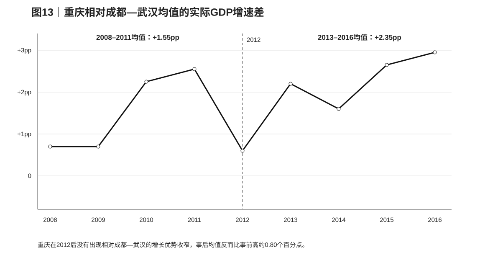

资料来源：重庆、成都、武汉历年统计公报及公报转载；作者计算。

重庆在2012后没有出现大连式的相对增长反转。它的GDP增速随全国周期从高位逐步下降，但相对于两个内陆参照城市的优势仍然维持。这个结果把“政治事件”和“宏观断崖”从经验上分开：政治关系变化发生了，但其宏观表现取决于当地同时存在的产业和投资动能。

## 6.3 信贷与固定资产投资

金融和投资数据使两地差异更加明显。重庆贷款增速从2011年的20.0%逐步降至2014年的14.6%和2016年的约11.2%，始终保持两位数；大连则从2011年的16.3%降至2014年的7.4%和2016年的2.3%。固定资产投资方面，重庆2014和2015仍增长18.0%和17.1%，大连则从2014年的4.6%降至2015年的−32.7%。

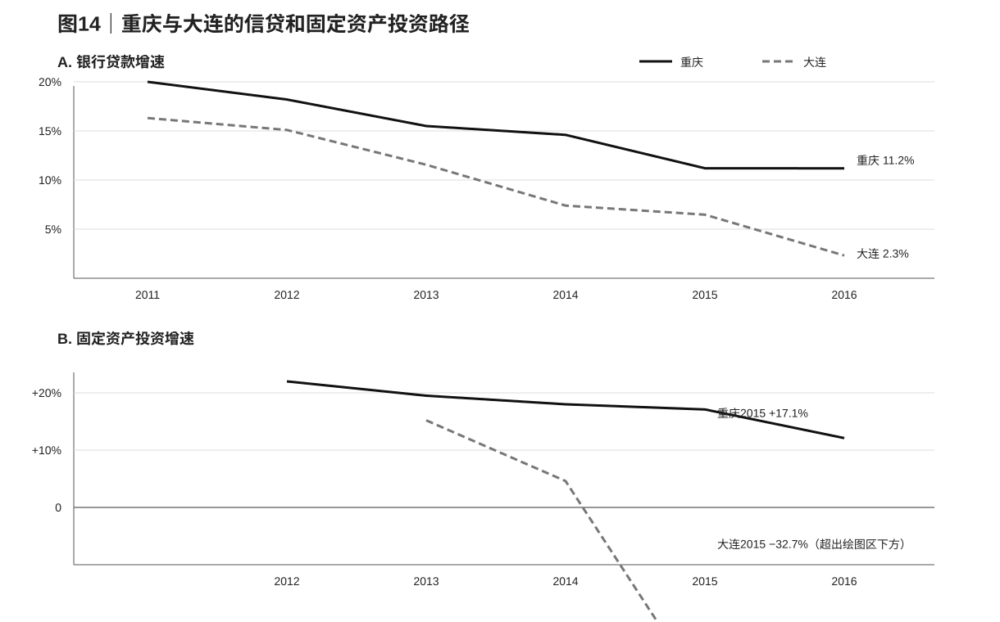

资料来源：重庆市、大连市统计公报和金融资料。

[表8｜重庆与大连的2012后经济—金融路径](./tables/table09_chongqing_dalian_comparison.csv)

资料来源：chongqing_parallel_s03c.csv、chongqing_parallel_s05a.csv、credit_s03c.csv。

重庆房地产开发投资到2014仍增长20.5%，2015才放缓至3.3%，与大连和辽宁2014起即大幅转负的路径也明显不同。政治事件落在重庆时，城市仍处在较强的工业化、城镇化和信用扩张周期；落在大连时，辽宁地产和高投资模式已经开始转折。这种结构差异与两地宏观结果的分叉高度一致。

## 6.4 含义

重庆案例支持一种条件性政治冲击解释。政治网络变化本身没有稳定地对应某个固定GDP或信贷降幅；地方投资机会、产业周期和银行资产质量决定了冲击是否会被吸收，还是通过信用和项目协调进一步放大。对大连而言，2012事件最值得关注的并不是它能否单独制造衰退，而是它是否在区域经济已经转弱时增加了边际融资和项目协调的摩擦。

---

# 07｜稳健性与讨论

## 7.1 基准结果的规格敏感性

省外相对异常对控制城市选择较稳定。武汉—青岛等权基准下，2008—2011与2013—2015的前后变化为−4.57个百分点；只使用武汉为−4.22个百分点，只使用青岛为−4.92个百分点。2008—2011事前差值存在缓慢收敛，按线性趋势外推后，2013—2015的平均实际差值仍比预测低约2.99个百分点。把2008—2009与2010—2011构造为事前伪事件，差值变化约−0.80个百分点，明显小于主窗口的反转。

区域嵌套结果对事前窗口也保持同一方向。以2007—2010、2008—2010和2009—2010为不同事前窗口，统一比较2013—2015时，大连相对辽宁的额外恶化约为−1.85、−1.63和−1.00个百分点。逐一剔除事前年份，结果大致落在−1.50至−2.27个百分点之间。

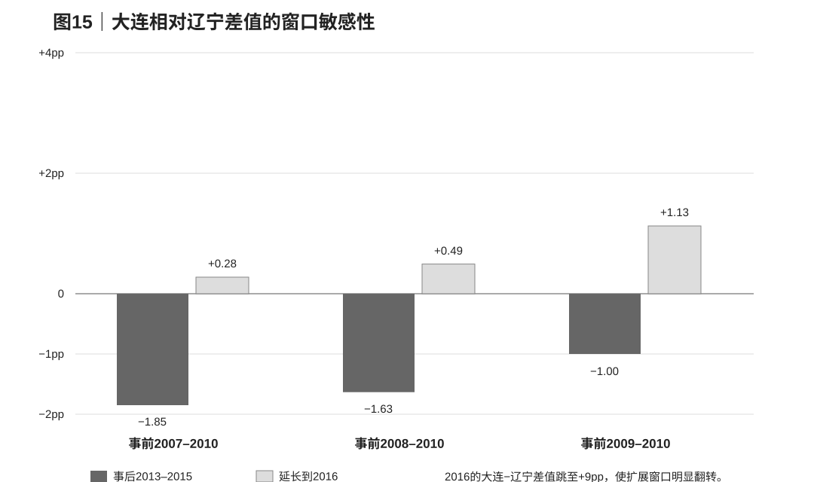

资料来源：panel_as_reported.csv；作者计算。

[表9｜基准异常与区域嵌套结果的规格敏感性](./tables/table10_robustness_matrix.csv)

资料来源：official_growth_panel_s02d.csv、panel_as_reported.csv；作者计算。

2016是所有窗口中最特殊的一年。大连当年公报实际GDP增速为6.5%，辽宁为−2.5%，年度差值跳至9个百分点，同时两地固定资产投资和历史GDP记录也出现明显变化。加入2016后，省外结果仍保持负向，但大连相对辽宁的短期平均会显著翻转，因此本文把2016视为统计与经济过程同时变化的延伸阶段。

## 7.2 合成控制的事前可行性

最初按城市类型选取的青岛、宁波、厦门和烟台四个沿海供体无法良好复制大连2005—2011的名义GDP扩张轨迹，最优解几乎把全部权重放在烟台，事前RMSPE仍达到19.65个指数点。扩大到武汉、天津、南通、唐山等非辽宁城市后，最优组合约为武汉72.9%和烟台27.1%，事前RMSPE降至2.54。

[表10｜合成控制事前拟合与供体剔除](./tables/table11_scm_feasibility.csv)

资料来源：scm_nominal_feasibility.py；名义GDP历史水平仅用于事前供体诊断。

供体剔除后，较好拟合仍能维持：去掉武汉时RMSPE约3.87，去掉烟台时约2.88，同时去掉两者时约3.89。由此看，正式合成控制的主要瓶颈已经不是供体空间，而是城市历史GDP序列的统计版本。烟台2013二手历史增速与当年公报存在明显差异，大连和天津的历史名义GDP也有异步修订，因此本文没有读取这些混合版本序列的事后合成缺口。统一统计版本的实际GDP指数完成后，空间安慰剂和处理后RMSPE比率将成为最有价值的下一步扩展。

## 7.3 证据层级

表11把全文主要机制放在同一框架中。辽宁地产与高投资周期同时满足时间吻合、跨地区比较和直接实体变量三个条件，是解释区域共同下行最完整的机制。大连信用与资产质量反馈同样具有较强的时间匹配和城市特异性，是解释区域内额外偏离最直接的近端机制。对日体系成熟具有明确的大连特异性，但变化较慢，更适合解释长期新增增长动力减弱。

[表11｜机制证据矩阵](./tables/table12_evidence_matrix.csv)

资料来源：本文各机制数据表综合。

政治网络的经验位置由这些结果共同确定。预算转移、国家级平台和大型项目没有出现与GDP和银行信用相同的断点，因此显性公共资源不是主要传导路径；贷款、民间投资和项目风险在2013以后相对弱化，使边际融资和协调成为更符合时间顺序的政治渠道。这个渠道与地产和信用风险相互作用，而不是独立于它们运行。

数量上，政治机制与其他大连特有因素主要竞争的是大连相对辽宁约1至2个百分点的额外弱化，而不是全部4至5个百分点的省外总异常。这一区间并不是政治效应估计，而是城市层异常的经验量级。要把政治网络与对日结构、信用风险和地方产业差异进一步区分，需要企业—银行信贷、政策性金融、央企新增投资以及可度量的干部政治关系数据。

## 7.4 对地方政治经济学的含义

大连案例提示，政治联系的经济价值具有明显的状态依赖性。地方经济仍处在高回报投资阶段时，项目本身能够吸引资本和政策资源，政治网络变化未必迅速转化为宏观收缩；当地产、工业和地方财政同时进入调整期时，边际授信、续贷和项目协调的差异会更重要。重庆与大连的分叉正体现了这一点。

这也提供了一个比“政治关系是否重要”更有解释力的问题：政治联系在哪些经济状态下最有价值，以及它通过哪些资源边际发挥作用。未来跨城市研究若能把政治网络变化与地产依赖、地方债务、银行资产质量或产业周期结合，可以直接检验这种异质性，而不再依赖单一城市事件推断平均效应。

---

# 08｜结论

本文从一个直观但过于单一的解释出发：2012年薄熙来政治失势是否导致大连失去政治网络优势，并进一步造成2014—2015的经济失速。多层反事实给出的答案更加具体。大连相对武汉和青岛确实出现了约4至5个百分点的增长差距反转，但其中更大的部分发生在辽宁整体相对省外城市的同步下行中；大连相对辽宁的额外弱化大致为1至2个百分点。房地产和固定资产投资的高度同步，使辽宁高投资和地产周期转折成为这一时期最清楚的区域背景。

真正更具大连特异性的变化出现在金融条件。2013以后，大连贷款增长持续弱于辽宁，2014—2015差距扩大，不良贷款率和民间投资同时恶化；但债券和资本市场融资仍然活跃，显性的财政转移、国家级平台和大型项目也没有同步收缩。这一组合把政治网络最可能的作用位置推向边际融资、项目协调和风险预期，而不是城市层面的资源总量。

重庆进一步说明这种作用取决于地方经济结构。2012政治事件之后，重庆仍保持较强的信贷、投资和相对增长表现；大连则处在辽宁地产、投资和信用环境迅速转弱的阶段。同一政治事件由此产生了不同的经济路径。政治关系能够改变地方资源配置的边际条件，但它的宏观后果取决于城市是否已有足够的投资机会、健康的资产负债表和新的增长发动机。

对大连而言，薄熙来政治失势可能改变了转弯时的摩擦，却不是这场转弯本身。现有证据最支持的图景是：区域投资周期决定主要下行方向，大连的产业和金融结构决定额外暴露，政治网络与信用反馈影响调整幅度。未来若能获得企业—银行微观信贷、政策性金融和央企新增投资，以及可核验的政治关系网络数据，才有可能把这一机制从城市层证据进一步推进到更严格的因果估计。

---

# 参考文献

Abadie, Alberto. 2021. “Using Synthetic Controls: Feasibility, Data Requirements, and Methodological Aspects.” *Journal of Economic Literature* 59(2): 391–425. https://doi.org/10.1257/jel.20191450

Abadie, Alberto, Alexis Diamond, and Jens Hainmueller. 2010. “Synthetic Control Methods for Comparative Case Studies: Estimating the Effect of California’s Tobacco Control Program.” *Journal of the American Statistical Association* 105(490): 493–505. https://doi.org/10.1198/jasa.2009.ap08746

Conley, Timothy G., and Christopher R. Taber. 2011. “Inference with ‘Difference in Differences’ with a Small Number of Policy Changes.” *Review of Economics and Statistics* 93(1): 113–125. https://doi.org/10.1162/REST_a_00049

Ferman, Bruno, and Cristine Pinto. 2019. “Inference in Differences-in-Differences with Few Treated Groups and Heteroskedasticity.” *Review of Economics and Statistics* 101(3): 452–467. https://doi.org/10.1162/rest_a_00759

Jia, Ruixue, Masayuki Kudamatsu, and David Seim. 2015. “Political Selection in China: The Complementary Roles of Connections and Performance.” *Journal of the European Economic Association* 13(4): 631–668. https://doi.org/10.1111/jeea.12124

Jiang, Junyan, and Muyang Zhang. 2020. “Friends with Benefits: Patronage Networks and Distributive Politics in China.” *Journal of Public Economics* 184: 104143. https://doi.org/10.1016/j.jpubeco.2020.104143

Li, Hongbin, and Li-An Zhou. 2005. “Political Turnover and Economic Performance: The Incentive Role of Personnel Control in China.” *Journal of Public Economics* 89(9–10): 1743–1762. https://doi.org/10.1016/j.jpubeco.2004.06.009

Olden, Andreas, and Jarle Møen. 2022. “The Triple Difference Estimator.” *The Econometrics Journal* 25(3): 531–553. https://doi.org/10.1093/ectj/utac010

Persson, Petra, and Ekaterina Zhuravskaya. 2016. “The Limits of Career Concerns in Federalism: Evidence from China.” *Journal of the European Economic Association* 14(2): 338–374. https://doi.org/10.1111/jeea.12142

## 制度背景与数据来源

新华社/人民日报体系，2012年3月15日，重庆市委主要负责同志职务调整。https://paper.people.com.cn/hqrw/html/2012-03/26/content_1030196.htm?div=-1

人民网资料，薄熙来履历（1992年任大连代市长、1993年起任市长、1999年任大连市委书记；人民网资料转载留存）。https://news.ifeng.com/mainland/200710/1008_17_250684.shtml

《人民日报》，2001年5月14日，第5版，〈如何经营城市这份国有资产——薄熙来访谈录〉。https://cn.govopendata.com/renminribao/2001/05/14/5/

年度统计公报、财政预算执行报告、人民银行金融资料、国务院/国家发改委政策批复和JETRO投资报告的逐条链接、发布机构、口径与提取日期统一保存在 ../data/sources.csv；主要图表的数据文件与来源映射见 APPENDIX_A_数据与来源.md。

---

# 附录A｜数据、变量与图表来源

## A1. 主要数据文件与原始来源

| 主题 | 论文用途 | 数据文件 | 原始来源 |
|---|---|---|---|
| 实际GDP增速 | 省外基准、趋势、供体剔除 | ../data/official_growth_panel_s02d.csv | 大连、武汉、青岛历年统计公报；2011大连为统计公报镜像并经独立材料交叉核验 |
| 辽宁区域参照 | 区域嵌套分解、窗口敏感性 | ../data/panel_as_reported.csv | 大连与辽宁历年统计公报 |
| 房地产与投资 | 区域投资机制 | ../data/real_estate_land_s03a.csv；../data/real_estate_investment_panel_s03a.csv | 各地统计公报、政府工作报告、辽宁财政资料 |
| 银行信贷与不良率 | 信用机制 | ../data/credit_s03c.csv；../data/credit_panel_s03b.csv | 各地统计公报、中国人民银行地方金融资料 |
| 民间投资 | 私人投资机制 | ../data/private_investment_s03c.csv | 大连、武汉、青岛政府/统计资料 |
| 融资结构 | 银行与直接融资分层 | ../data/financing_structure_s03d.csv；../data/financing_substitution_s03c.csv | 大连统计公报、人民银行大连中心支行报告、政府工作报告 |
| 上级财政资源 | 显性公共资源 | ../data/fiscal_resource_audit.csv | 财政部转载的大连预算执行报告 |
| 领导时间线 | 治理连续性 | ../data/leadership_timeline.csv | 人民网干部简历与官方转载 |
| 国家平台/重大项目 | 项目与政策资源 | ../data/major_project_policy_ledger.csv | 国务院、国家发改委、辽宁省政府、企业项目公告 |
| 日本暴露 | 长期结构机制 | ../data/japan_exposure_s03b.csv | JETRO 2013—2015年度对华直接投资报告 |
| 重庆平行案例 | 机制外部比较 | ../data/chongqing_parallel_s03c.csv；../data/chongqing_parallel_s05a.csv | 重庆、成都、武汉统计公报及金融资料 |
| 合成控制可行性 | 事前供体拟合 | ../scripts/scm_nominal_feasibility.py | 二手历史名义GDP聚合序列，仅用于事前供体诊断 |

每条原始观测的完整URL、发布机构、发布日期、原文定位和提取日期见 ../data/sources.csv。

## A2. 主要图表对应关系

| 正文编号 | 文件 | 底层数据 |
|---|---|---|
| 图1 | figures/fig01_growth_paths.svg | official_growth_panel_s02d.csv |
| 图2 | figures/fig02_relative_gap.svg | official_growth_panel_s02d.csv |
| 图3 | figures/fig05_gap_pretrend.svg | official_growth_panel_s02d.csv |
| 图4 | figures/fig06_outside_vs_liaoning_gap.svg | official_growth_panel_s02d.csv + panel_as_reported.csv |
| 图5 | figures/fig07_real_estate_growth.svg | real_estate_investment_panel_s03a.csv |
| 图6 | figures/fig08_investment_index.svg | real_estate_investment_panel_s03a.csv |
| 图7 | figures/fig09_credit_growth_gap.svg | credit_s03c.csv |
| 图8 | figures/fig10_npl_ratio.svg | credit_s03c.csv |
| 图9 | figures/fig11_upper_fiscal_resources.svg | fiscal_resource_audit.csv |
| 图10 | figures/fig12_governance_project_timeline.svg | leadership_timeline.csv + major_project_policy_ledger.csv |
| 图11 | figures/fig13_chongqing_relative_gap.svg | chongqing_parallel_s03c.csv |
| 图12 | figures/fig14_chongqing_dalian_paths.svg | chongqing_parallel_s03c.csv + credit_s03c.csv |
| 图13 | figures/fig15_window_sensitivity.svg | panel_as_reported.csv / window_sensitivity.csv |

## A3. 变量与口径

实际GDP增速采用年度统计公报直接报告的可比价格增速。固定资产投资和房地产开发投资保留各年官方统计范围；2011前后固定资产投资统计范围变化在原始字段中单独记录。银行贷款增速优先使用报告值，缺失时由可比年初余额和当年新增额计算，并保留计算口径。财政资源仅使用预算执行报告明确披露的税收返还、一般性转移支付、专项转移支付或上级专项拨款，不以财政支出减本级收入推算。

2012年作为事件过渡年，不进入主前后均值；2016年进入扩展敏感性。对日投资2015年存在JETRO报告注明的统计方法变化，因此正文使用报告同比方向和项目数，并避免把2014与2015绝对金额直接拼接。
