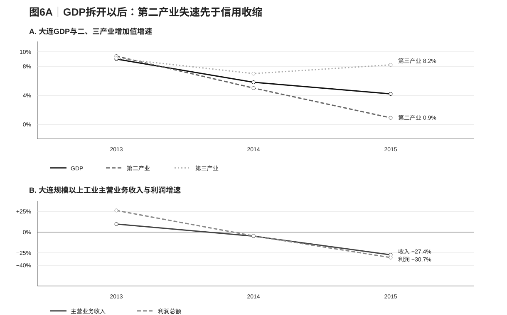

# 05｜机制证据：区域投资、信用分层与资源配置

## 5.1 房地产和高投资模式：区域层异常的实体基础

第四节显示，省外总异常中更大的部分发生在辽宁整体相对省外城市的同步下行。房地产和固定资产投资为这一结果提供了最直接的实体解释。2013年，大连、辽宁和武汉房地产开发投资仍分别增长22.5%、18.2%和21.0%；到2014年，大连下降16.4%、辽宁下降17.8%，而武汉仍增长23.5%、青岛增长6.6%。2015年大连和辽宁房地产投资进一步下降37.2%和约32.9%，武汉仍保持9.7%的正增长。

资料来源：大连市、辽宁省、武汉市、青岛市统计公报与政府工作报告；原始来源ID见数据附录表A1。

大连与辽宁不仅方向同步，投资结构也非常接近。2013年房地产开发投资占固定资产投资的比重分别为26.4%和26.0%，2014年为21.1%和21.7%，2015年为19.7%和20.2%。把2013年的投资规模归一化为100后，到2015年大连与辽宁的总固定资产投资指数分别约为70.4和71.2，房地产投资指数分别约为52.5和55.2。

资料来源：同图5；作者计算。

2013—2015年，大连固定资产投资减少1918.8亿元，其中房地产开发投资减少812.9亿元；辽宁对应减少7151.0亿元和2892.1亿元。房地产投资减少额分别相当于总固定资产投资减少额的42.4%和40.4%。如果只看2014—2015最剧烈的一年，房地产对应比例降到24.0%和25.7%，说明2015的投资收缩已经扩展到更广泛的建设和工业项目。

[表4｜大连与辽宁固定资产投资下降的构成](./tables/table06_investment_accounting.csv)

资料来源：real_estate_land_s03a.csv；作者计算。

这组结果把第四节的区域分解落到了实体经济上。2014房地产先行转负，2015总投资进一步下坠，大连与辽宁几乎沿着同一条轨迹变化。辽宁高投资和地产周期的转折由此构成大连短期失速的主要区域背景。

## 5.2 GDP拆开以后：真正失速的是第二产业和企业现金流

把GDP继续拆开，2014—2015的变化就更容易和融资问题连接起来。2013年大连第二产业增加值增长9.4%，第三产业增长9.1%，两者仍处在接近的扩张速度；2014年第二产业降至5.0%，第三产业仍增长7.0%；到2015年，第二产业只增长0.9%，第三产业仍增长8.2%。三次产业对经济增长的贡献也发生了同方向变化：第二产业贡献率从2013年的55.4%降至2014年的44.8%，2015年进一步降至10.6%，第三产业贡献率则从41.4%升至52.4%和85.5%。换句话说，2015年的4.2% GDP增速并不是“整座城市所有部门一起只剩4.2%”，而是服务业仍保持较快增长，原来更依赖资本、设备和项目融资的第二产业几乎停止贡献新增增长。

[表4A｜从GDP构成到企业现金流：2013—2015大连实体经济与金融条件](./tables/table04A_sector_cashflow.csv)

资料来源：大连市2013—2015年国民经济和社会发展统计公报（DL2013、DL2014、DL2015）；贷款与不良率来自同期金融统计；辽宁对照来自辽宁省2013—2015年统计公报（LN2013、LN2014、LN2015）。

辽宁呈现出非常相似的产业分化。2013年辽宁第二产业和第三产业分别增长8.9%和9.2%，2014年分别为5.2%和7.2%，2015年第二产业转为−0.2%，第三产业仍增长7.1%。因此，第四节看到的辽宁区域共同下行，真正发生得最深的也是第二产业，而不是所有产业同步衰退。大连与辽宁的共同部分由此可以更具体地理解为重资产、工业和建设活动的回报快速恶化，而服务业仍在接住一部分总量增长。

对融资最关键的不是增加值本身，而是企业现金流。大连规模以上工业在2013年仍增长10.2%，主营业务收入增长9.7%，利润增长26.1%；2014年规模以上工业增加值增速降至4.3%，主营业务收入和利润分别下降4.9%和4.6%；2015年规模以上工业增加值下降4.5%，主营业务收入下降27.4%，利润下降30.7%。建筑业总产值也从2013年的+14.2%转为2014年的−8.7%和2015年的−30.0%。这意味着银行在2014—2015面对的并不是一个抽象的“GDP减速”，而是一批原本依赖设备、土地、厂房和项目现金流的借款主体，其收入、利润和项目回报同时恶化。

这条链恰好能够解释下一小节的金融数据。2013—2015，大连贷款增速从11.6%降至7.4%和6.5%，不良贷款率从1.07%升至1.86%和2.16%。银行更谨慎既可能表现为新增授信减少，也可能来自企业自身减少借款需求，但两者都以同一个实体变化为基础：工业和建设项目能够产生的现金流下降，原有抵押物和项目收益的安全边际变薄。于是，“区域投资周期 → 第二产业和企业利润恶化 → 资产质量下降 → 银行信用收缩 → 新投资进一步减少”构成了一条比“GDP下降所以贷款下降”更完整的传导链。

## 5.3 银行信用与民间投资：大连城市层的额外弱化

与房地产不同，银行贷款在2013以后表现出更明显的大连特异性。2010年大连贷款增速曾明显高于辽宁，2011—2012两者已基本收敛；2013年大连贷款增长11.6%、辽宁12.8%，差距约−1.2个百分点；2014和2015差距扩大到约−3.4和−3.3个百分点，2016进一步扩大到约−4.3个百分点。

资料来源：大连市、辽宁省统计公报及人民银行金融资料；作者根据年末余额和可比新增额计算部分增速。

新增贷款份额也显示同一方向。大连新增贷款占辽宁全省新增贷款的比重从2013年的31.4%降至2014年的23.4%和2015年的21.9%。与此同时，大连不良贷款率从2013年的1.07%升至2014年的1.86%、2015年的2.16%和2016年的3.22%。

资料来源：大连市金融运行与统计资料。

2014年民间投资进一步提供了企业侧证据：大连仅增长2.4%，武汉增长16.1%，青岛增长24.0%。GDP、房地产、银行信用、资产质量和民间投资在同一年共同转弱，说明大连经历的不是单一统计指标波动，而是实体活动与金融条件相互强化的调整过程。

[表5｜2013—2016年大连信用、民间投资与融资结构](./tables/table07_credit_financing.csv)

资料来源：credit_s03c.csv、private_investment_s03c.csv、financing_structure_s03d.csv。

融资结构同时揭示了一个重要差异。2014—2016银行贷款净增从755.5亿元降至709.9亿元和267.5亿元，而资本市场直接融资仍保持在约1031亿元、1172亿元和1417亿元的较高规模。能够使用债券和资本市场的成熟企业仍有融资渠道，压力更多集中在依赖银行信用、现金流和地方协调的边际项目与民间投资。这一结构使政治网络最可能作用的环节从“城市是否有资金”转向“哪些主体在风险上升时还能获得边际信用”。

## 5.4 显性公共资源：财政、国家平台与大型项目仍在延续

银行信用走弱并没有伴随预算内上级资源同步下降。2014年中央和辽宁省对大连的税收返还及转移支付合计188.97亿元，2015年为198.10亿元，名义增长约4.8%。2011—2012财政报告使用较早分类方式，图9将其单独标识，不与2014以后强行连成同口径时间序列。

资料来源：财政部转载的大连市预算执行报告，DLF2011—DLF2015。

国家级平台和大型项目也继续推进。2014年国务院批复设立金普新区，2016年大连进入跨境电子商务综合试验区，2017年辽宁自贸试验区设置大连片区；2015年Intel宣布对大连工厂进行新一轮大规模再投资。领导时间线同样显示，市委书记唐军从2011年任职至2017年，市长李万才在2012事件后继续任职到2014年底，2014—2015的经济分叉发生在高度连续的最高层领导任期内。

资料来源：人民网干部简历、国务院和国家发改委批复、地方政府工作报告及项目公开资料。

[表7｜财政、国家平台、领导与重大项目时间线](./tables/table08_fiscal_projects_governance.csv)

资料来源：fiscal_resource_audit.csv、leadership_timeline.csv、major_project_policy_ledger.csv。

显性资源和银行信用由此走出了不同路径。大连仍然能够进入国家政策平台、承接大型项目并获得预算内上级资源，而地方自有财力、银行信用和民间投资明显承压。政治网络若影响了2014—2015的调整，更可能发生在项目融资、续贷、风险评价和跨部门协调等边际环节。

## 5.5 对日结构：新增进入放缓，而非2014年突然撤离

大连对日本资本和企业的暴露远高于一般城市。2014年，日本实际投资约25.35亿美元，占大连实际外资18.1%；JETRO资料显示，辽宁省日资投资中八成以上集中在大连。真正持续变化的是新项目进入：日本新项目数从2012年的136个降至2013年的75个、2014年的61个和2015年的47个，三年减少约65%。

[表6｜日本对大连投资与新项目进入](./tables/table06_japan_exposure.csv)

资料来源：JETRO 2013—2015年度对华直接投资报告；2015存在统计方法调整，表中保留报告口径同比。

实际投资的时间顺序与项目数不同。2013年日本对大连实际投资约26.27亿美元，JETRO描述为约为上年的2.5倍；2014年仅下降3.5%，而同期全国日本对华FDI按中方统计下降38.8%。也就是说，大连GDP在2014已经明显相对失速，但日本资本对大连并没有同步出现突然撤离。到2015年，JETRO报告日资实际投资明显下降，不过当年统计方法发生变化，跨年绝对金额的可比性下降。

这组证据更符合“新增进入逐渐减少、存量企业继续增资和升级”的成熟过程。它能够解释为什么大连第一轮对日增长发动机的增量效应逐渐变弱，却不太适合解释2014年GDP和信贷为何突然同时分叉。对日结构因此是大连相对辽宁的长期特有暴露，而短期2014—2015的近端变化更集中在地产周期、信用风险和边际融资。

## 5.6 机制小结

四组机制拼在一起后，空间层级与时间顺序变得清楚。辽宁地产和总投资在2014—2015同步下行，对应第四节更大的区域层异常；大连银行贷款、民间投资和不良率表现出更强的城市特异性，对应区域共同下行之上的额外弱化；预算转移、国家平台和大型项目保持连续，说明显性公共资源没有与银行信用同步收缩；对日项目新增持续减少，则构成更慢的长期结构约束。

由此形成的传导链是：区域投资周期首先压低项目回报和资产质量，大连特有的金融与产业结构决定额外暴露，边际融资和协调能力影响收缩幅度。下一节用重庆检验这一机制是否具有地方结构依赖性。