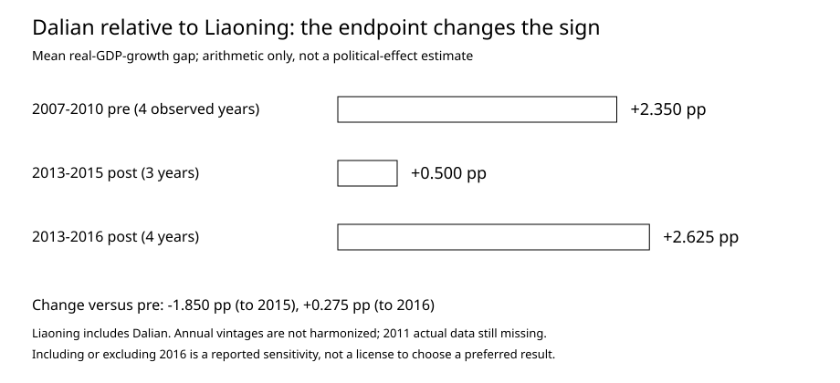

# S01｜先算了一遍：为什么现在不能给“薄熙来因素”分配百分比

2026-10-06｜计算已在本地运行。输入为各年统计公报发布值，不是统一修订面板。可复现：`python scripts/analyze.py`。完整研究设计见 `../00_RESEARCH_DESIGN.md`。

## 1. 先固定可以回答的窄问题

本轮只问：大连与辽宁的**报告GDP增速差**在事件前后如何变化，结论对观察窗口和基准假设有多敏感？

这不是最终DiD。辽宁总量包含大连，也可能受到政治网络外溢；不同产业和数据版本尚未控制。它是区域参照，不是已经合格的未处理组。

研究原定事前2005—2011年。目前两地都有合格观测的事前年份只有2007—2010年。因此以下计算**明确使用这4年**，不冒充完整的原定窗口，也不把2011预计值塞进基期。2012在图中留空，事件竖线不代表已经识别断点。

## 2. 先看全年逐点差距

定义 `gap_t = 大连报告实际GDP增速 − 辽宁报告实际GDP增速`，单位为百分点。

| 年份 | 大连 | 辽宁 | 差距 |
|---|---:|---:|---:|
| 2007 | 17.5% | 14.5% | +3.0 |
| 2008 | 16.5% | 13.1% | +3.4 |
| 2009 | 15.0% | 13.1% | +1.9 |
| 2010 | 15.2% | 14.1% | +1.1 |
| 2013 | 9.0% | 8.7% | +0.3 |
| 2014 | 5.8% | 5.8% | 0.0 |
| 2015 | 4.2% | 3.0% | +1.2 |
| 2016 | 6.5% | −2.5% | +9.0 |

来源：`../data/panel_as_reported.csv`中对应年份；每行均通过source_id追溯至原统计公报，URL和章节在`../data/sources.csv`。

这里有两个同时成立的事实：2013—2015大连并没有比辽宁增长更慢；但它相对于辽宁的领先幅度，比2007—2010明显小。**“事后仍高于辽宁”不等于“没有额外损失”。** 需要比较变化，而不是只看事后水平。

## 3. 只改变事后终点，算术结果就会改变符号

| 窗口 | 事前平均差距 | 事后平均差距 | 差距的变化 |
|---|---:|---:|---:|
| 2007—2010 对 2013—2015 | +2.350 | +0.500 | **−1.850** |
| 2007—2010 对 2013—2016 | +2.350 | +2.625 | **+0.275** |

公式只是 `mean(gap_post) − mean(gap_pre)`。

到2015，结果像是大连额外减速；加入2016，结果又像是它相对更抗跌。**这两个数都不是政治效应。** 它们说明，未经统计版本和2016专项审计，作者选择哪个截止年，就足以影响故事方向。

不能因此挑选2015结束来支持政治冲击，也不能挑选2016结束来否定政治冲击。原定2013—2016为主要窗口，2013—2015仅作透明的敏感性检查。

## 4. 更早就有差异趋势，不能默认平行

2007—2010的差距从3.0变成1.1个百分点，四点描述性线性斜率为 **−0.72个百分点/年**。

这不是正式统计拒绝平行趋势：只有4个点，年份又覆盖金融危机，不能靠一个P值决定。但它足以提醒我们，直接假定“没有2012事件，大连会一直维持2.35个百分点领先”，没有得到数据支持。

再做一个纯粹的模型敏感性演示：若把这4年的线性趋势机械外推，2013—2015的预测平均差距是−1.61，实际是+0.50，二者相差+2.11个百分点。这个方向与“保持事前均值”给出的−1.85相反。

**线性外推也不是可信反事实。** 这里只说明：合理反事实不能由作者随手选择。需要更长事前序列、更多供体、事前留出验证、行业暴露与统一统计版本；不能挑一个恰好能讲通故事的趋势修正。

脚本同时保存了3套事前窗口×2套事后窗口的6种算术结果，以及逐一剔除事前年份的8种结果，全部报告而不挑选。

## 5. 投资确实明显下行，但它还不能告诉我们是谁造成的

2013—2016年大连与辽宁投资增速差依次为+0.1、+6.1、−4.9、−5.0个百分点。2015与2016，大连投资跌幅比辽宁略大，但两地报告的投资都经历很大幅度下降。

大连2010年报告投资增长55.3%，而2016下降68.5%。期间还有统计范围和历史核算问题。先把这一段当作“高投资模式、区域周期、测量变化及政治资源可能共同作用的候选事实”，而不是自动贴上某一个原因。

投资图可由脚本生成。图上保留缺失年份；事前全社会口径与事后不含农户口径不用于跨期因果回归。

## 6. 外资与项目目前能约束什么说法

2014大连外资140亿美元与FDI25亿美元不是同一个指标。把它接到2015年27.03会造出一个不可用的80.69%降幅。反过来，25→27.03→30的算术增长也不能证明政治关系无影响；统计范围尚未统一，而且没有无事件反事实。

2014金普新区批复、2015国家发改委规划评审说明国家级支持没有全部消失；但它们不量化支持的相对损失。申请起点、审批延误、拨款时间和补偿性政策都还要调查。见[数据审计](01_DATA_AUDIT.md)及[机制账本](../data/mechanism_events.csv)。

## 7. 计量升级判定

| 项目 | 本轮状态 |
|---|---|
| 2012事件设定、重庆另案 | 已固定 |
| 主表来源、缺失与口径 | 已登记；尚非完整面板 |
| 基期/终点/预趋势敏感性 | 已运行 |
| 合格沿海供体与辽宁去大连 | 尚未形成 |
| 统一回溯版本 | 尚未取得 |
| 事件研究、合成控制和空间安慰剂 | **未运行**；不能在当前资料上升级因果解释 |
| 政治网络及治理机制分离 | 只有线索，直接资源流仍缺 |
| 政治因素贡献率 | **不可识别，未估计** |

真正的初步进展不是得到了一个新百分比，而是明确了哪几种很容易产生百分比的算法会误导。下一轮首先解决事前序列与资源口径，再扩展供体和重庆。缺失的外围数据可以跳过，因果识别的基础条件不能跳过。
